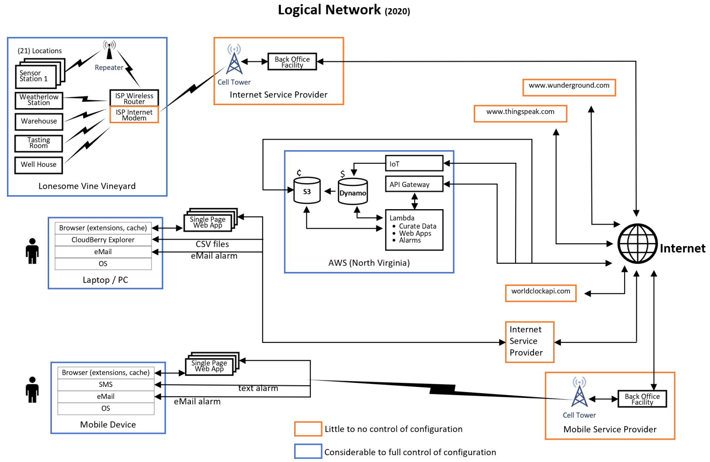

#Introduction
This repository documents the architecture and some design elements of a multi-platform IT solution developed for Lonesome Vine Vineyard and Winery located in Montague County Texas, USA.  It fulfills all original design specifications, and to date, continues to meet all operational requirements.  The solution's primary focus is on intelligent, data-driven, irrigation automation.  However, it additionally supports ad-hoc, manual data collection and basic fermentation monitoring.  The solution's near-real-time sensor data collection enables automated alarm state detection / notification (e.g., low battery level, freezing temperature, pH level, missing sensor data).  

By up-front, mutual agreement, I maintain full rights to all aspects of the solution.  I have elected to share detailed insight into my work but beyond any doubt, all client specific detail (e.g., ids, passwords, AWS account numbers, etc.)  has been removed from all information contained within this repository.  None of my client's sensitive data is present on this repository.

This repository contains source code for the entire solution however, recreating a comparable solution will require more than source code.  Standing up a comparable solution would require an account with a public cloud services provider, configuration  of resources within that account (i.e., services as well as service-to-service integrations), and a wide variety of independent, interoperating components such as a WiFi network, service from an Internet Service Provider (i.e., a modem), an assortment of physical sensors (e.g., temperature, soil moisture sensors, pH, liquid flow meter), low-power consumption sensor platform boards, an 8-channel relay module (e.g., 5V DC to 24V AC), and single board computers.  Each of these independent components require initialization, configuration, and physical deployment.  Regardless, any individual possessing a moderate degree of programming skill and an intermediate level of AWS experience should be able to bring up their own version of this solution with relatively little difficulty.  Numerous tips and techniques are contained within the multiple README.md files located in the different subdirectories.  I wrote the README.md files assuming a reader possession mastery of fundamental software development techniques and a solid command of primary, basic AWS services.

#Context for Solution Development
In late 2019 I was approached by a prospective client expanding a vineyard and winery in the north Texas, USA area (i.e., Lonesome Vine Vineyard and Winery).  My client had reached the decision to transition from manual vineyard operations to a data-driven, automated approach.  After thoroughly reviewing several full-service providers (each offering complete, managed solutions) the client commissioned me to develop a custom solution that could be operated, with little to no technical assistance, by a reasonably tech-savvy vineyard operator.

Unlike far too many previous assignments over my IT career (both as an employee of an industry-leading IT services company and as an independent contractor), this assignment was a complete "greenfield" opportunity.  I was not shackled by prior investments in a particular technology(ies) nor were there any incumbent IT staff with personal, technology-biased agendas.  Lastly, this project was free of both architecturally crippling financial constraints and any seemingly arbitrary, "drop dead" end-dates. 

I began my IT career as a C++ developer and transitioned, over time, to a solution architecture role and finally to an enterprise architecture / IT strategy role.  For this engagement, I employed the full spectrum of my collective professional experience.  In doing so I came to realize that I enjoy the solution architecture role, working specifically with AWS, far more than any other.

The following design principles emerged from initial planning sessions with the client.  Due to the breadth of my experience, I was able to use this high-level list, augmented with a handful of teleconferences, covering various vineyard operational topics (along with the occasional client review of a GUI prototype), to build out the entire solution.

*General
  *To the fullest extent possible, simplify the solution and the effort required to maintain it
     *Use as few "fit for purpose" components as possible
     *Use open source / commercial technologies; developing custom software is the last resort
     *Use widely available, widely adopted, mature technologies (i.e., open source or commercial)
     *Use a technologies "as is", introducing the absolute minimum amount of customization that either adds to or deviates away from the technologies "out of the box" functionality
  *Vineyard operators will interact with the solution using a standard web browser
  *Minimize expense, both capital investment and ongoing operational costs
*Physical devices
  *When selecting / designing sensor station platforms, the primary consideration is the physical environment into which it will be deployed
  *Minimize the effort / disruption to vineyard operations for replacing individual sensor station that require regular maintenance or outright replacement
  *Minimize the data and processing logic residing on a sensor station platform
  *Homogenize the ingestion of sensor data into the long-term data storage backend
*Backend
   *All long-term data storage, all vineyard operator data access, and maximum amount of processing logic
   *Single sourced, public cloud vendor (i.e., AWS)
      *100% Serverless
      *Starting position
         *Use service capabilities "as is"
         *Fully leverage service-to-service integrations built into the AWS platform
   *Ease the exportation of data
   *Maximize the public cloud backend and minimize all other platforms (i.e., sensor stations, web browsers, third-party service providers) for such things as
      *Data storage
      *Processing logic
   *Employ a modern, flexible security model
   *Use mainstream, modern technologies and development techniques
      *Stateless, idempotent, RESTful APIs
      *Python, Boto3, JSON, HTML 5, JavaScript
*Account for nature of data communication link between the vineyard and the outside world (i.e., Internet -> AWS)
  *Experiences infrequent unexpected outages of variable duration.  
  *Experience infrequent periods of insufficient bandwidth
  *The solution must continue normal operations for a reasonable amount of time (i.e., less than 3 days) in the event of a complete Internet outage or insufficient bandwidth

 
#Solution Overview
High-level, conceptualization of the solution documented in this repository.

Vineyard operators can interact with the solution through multiple channels.  An AWS IAM user account is set up for each operator providing "read only" access to a select number of AWS services.  This enables read-only AWS Console access to S3 buckets, DynamoDB tables, and custom CloudWatch dashboards.  Vineyard operators can use their IAM user access key id / secret access key with CloudBerry Explorer to interact with S3 buckets.  User ids / passwords from an AWS Cognito user pool are also provisioned for each vineyard operator to enable secure access to multiple single page web applications.  These different applications enable the operator to perform several different tasks such as view sensor data / operational logs, perform ad hoc data entry, configure the irrigation controls, and configure the alarm settings for monitoring near-real-time sensor data.  If an alarm condition is detected operators receive notification by SMS message and / or email message.

The solution's backend was constructed in the AWS public cloud.  By design, all solution data is stored in AWS, however operators are free to download local copies of sensor data at any time.  Data lifecycle management is in place to purge expired system logs and to migrate aging sensor data to less expensive S3 storage tiers.  By design,  processing logic is maximized on the AWS platform and minimized on other solution platforms (e.g., sensor stations).  All sensor data ingestion is handled in the same manner, although some sensor platforms require augmentation by the AWS Lambda service because they cannot directly interact with AWS IoT (i.e., interact with an MQTT queue and / or supply certificates and security credentials).

Multiple third-party services are leveraged by the solution.   At present, two service providers are leveraged to receive raw sensor data from two different sensor platforms that cannot be configured to directly send sensor data to AWS IoT.  A third-party service is employed to provide a date / time synch to a sensor platform requiring accurate date / time awareness.  And finally, a service provider is employed to provide reverse proxy service enabling remote login sessions to single board computers (not depicted in the diagram above) that sit behind a firewall's NAT (network address translation) table.  Remote log in sessions are infrequently used to facilitate software updates and for general trouble shooting of irrigation control and fermentation monitoring functions.

From an architectural analysis perspective, it is useful to segment the physical environments located at the vineyard and winery into two categories: indoors and outdoors.  All locations in both environment types are covered by the vineyard and winery's WiFi network.  Two different sensor station platforms were selected for outside locations.  The primary criteria used to select these outdoors sensor platforms included electrical power self-sufficiency, low operational power consumption, and resiliency when exposed to outside conditions.  One of the outside location platforms collects overall weather conditions while the other collects current conditions at a specific vineyard location (i.e., "at the vine"). A  single sensor station platform was selected for all inside locations.  Currently, there are two inside locations, each specialized to a different task. 

This logical network diagram provides an informative, high-level, conceptual depiction of the solution.

#Repository Organization
The information contained within this repository is organized into four subfolders: **vineyard**, **irrigation**, **fermentation**, and **backend**.  The first three subfolders contain details on physical devices, communications, source code, and a collection of practical tips and techniques.  The backend folder contains similar information but for the public cloud backend that underpins the entire solution (i.e., vineyard, irrigation, and fermentation).   

All architectural and technical aspects of the solution's fermentation monitoring subsystem can be found within the solution's irrigation control subsystem.  As such, these two subsystems are sometimes documented together in this repository.  In some places fermentation monitoring sections refer the read to irrigation control sections.

The **vineyard** folder covers two sensor station platforms: the commercially available Vinduino R3 Sensor Station and the commercially available Smart Home Weather Station.  This folder contains an informative README.md file as well as a source code subdirectory.

The **irrigation** folder focuses on a commercially available single board computer platform: Raspberry PI 4.  This folder contains an informative README.md file as well as a source code subdirectory.

The **fermentation** folder focuses on a commercially available single board computer platform: Raspberry PI 4.  This folder contains and informative README.md file as well as a source code subdirectory.

The **backend** folder provides information on the AWS backend supporting the solution.  It covers service configuration, service-to-service integration, source code (e.g., Lambda functions), cloud resident data, and single page web applications.   This folder contains an informative README.md file as well as a source code subdirectory.
