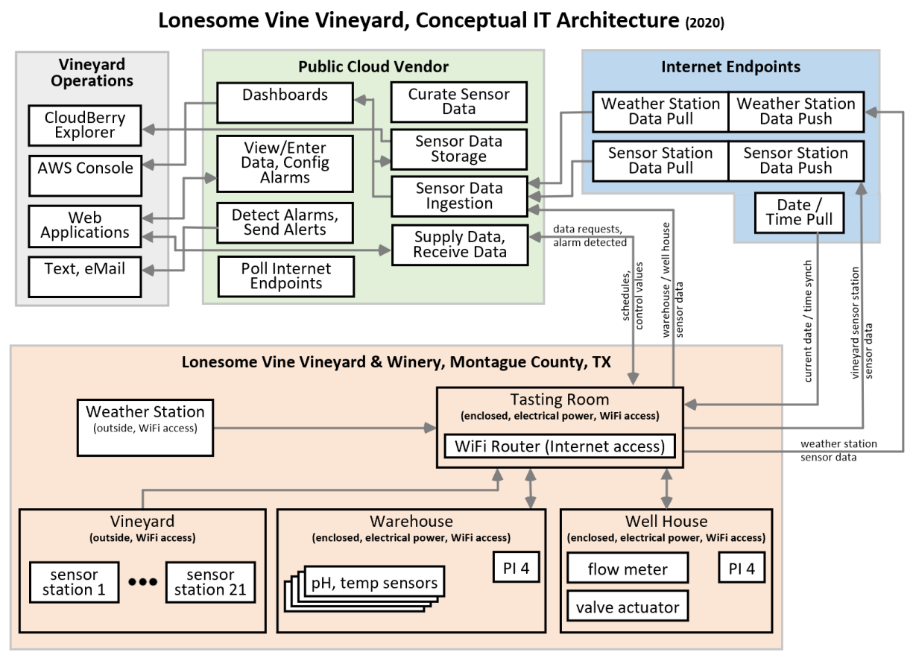

# Manage Irrigation
This repository does not contain a bundle of source code that you can simply clone to your machine in order to bring up a functioning irrigation management solution for an agricultural endeavor.  While it does contain some source code and technical guidance, it is intended to serve as a template that you can use to create a solution similar to one that I delivered to a client, a growing north Texas vineyard and winery, in need of an irrigation management solution.

## Context for Development
My client is operating, as well as expanding, a vineyard and winery in the north Texas, USA area.   In 2019 he decided to adopt a data-driven approach for all vineyard and winery operations.  He researched both full-service providers (offering complete, managed solutions) and the hardware / software necessary to bring a custom solution.  In late 2019 I was commissioned to develop a custom, Internet-accessible, irrigation management solution for his vineyard and winery.

The following decisions and design principles emerged from initial design / planning sessions.
* Generation 1 hardware selection
   * Vineyard sensor station platform: commercially available, Vinduino R3 Sensor Station
   * Weather station platform: commercially available WeatherFlow Smart Home Weather Station
* Backend data processing and storage
    * 100% AWS-based
    * 100% serverless
* Ingestion of remote sensor data
    * Strict one-to-one relationship between a remote sensor and an AWS IoT Thing
    * All sensor data routes through an AWS IoT Thing’s shadow document

## Overview
Conceptual IT diagram.  


You will notice that the vineyard / winery maintains three enclosed, permanent structures.  Thirteen sensor station platforms are deployed outside of any structure; completely open to the elements.  Of these thirteen sensor stations, twelve vineyard sensor stations are equally distributed across the cultivated acreage and a single weather station is located just outside of the tasting room.  The warehouse contains sensor stations that regularly report on acidity / pH readings.  And finally, the well house contains a micro controller station capable of actuating irrigation valves in response to inbound signaling from a custom single-page, web application.  All sensor stations (i.e., micro controllers) are networked via consumer-grade WiFi equipment (i.e., 802.11 wireless local area network routers, repeaters).

The remainder of this GitHub README.md is organized as such:
* Sensor Stations
* AWS Backend
* Vineyard Operations

NOTE: 
While I do provide source code snippets and technical guidance for implementing a similar solution, I do not provide background explanations of AWS services and micro controller programming.  Such information can be readily sourced via basic Internet searches.  The GitHub repository will be most meaningful to experienced AWS solution architects that possess basic software development skills.

## Data Sensors 

### WeatherFlow Smart Home Sensor Station
The Smart Home Weather Station is commercially available from WeatherFlow (www.weatherflow.com.)


You cannot program the Smart Home Sensor Station to directly update an AWS IoT Thing’s shadow document.  Smart Home Sensor Stations send data sensor readings to a WeatherFlow backend which you are allowed to access in order to retrieve your data.  You can obtain your data in any number of ways (e.g., Websocket connection or RESTful API call).  In addition, you can configure your personal account in the WeatherFlow backend to forward your sensor data to an online data services provider such as WeatherUnderground (www.wunderground.com.)

For this solution the WeatherFlow backend is polled once a day using a RESTful API call that returns a JSON document just under 2,000 characters in size.  At present, a publicly shared API key,  that is available to any WeatherFlow customer who cares to use it, is used in this daily API call.  Should an issue arise with the use of this shared API key it will be readily apparent and easily remedied (i.e., procuring, for a fee, a private API key to guarantee availability / throughput).   More detail on polling this data is provided below in the AWS Backend / Sensor Data Ingestion section.


### NodeMCU
This is what the NodeMCU micro controller looks like. 


  
All proof of concept work was conducted using the NodeMCU micro controller.  This is one of the actual physical sensor platforms that was assembled for conducting early prototype work.
  


Here is an example of the firmware that was flashed to a NodeMCU micro controller, during some of the early prototype work, via the Arduino IDE (www.arduino.cc.)

```
//Humidity+Temp Sensor
#include <DHT.h>
#define DHT11_PIN 2

//OneWire Temp
#include <OneWire.h>
#include <DallasTemperature.h>

//Soil Moisture

//Humidity+Temp Sensor
DHT   DHT(DHT11_PIN,DHT11);
float tempC;
float tempF;
float humidity;

//OneWire Temp
const int oneWireBus = 4;
OneWire oneWire(oneWireBus);
DallasTemperature DTMP(&oneWire);
float temperC;
float temperF;

//Soil Moisture
const int SENSE_PIN = 0;
const int THRESHOLD = 1500;
int       soil_moisture;

void setup()
{
  //General
  Serial.begin(115200);

  //Initialize the different sensors 
  DHT.begin();      //Humidity+Temp
  DTMP.begin();      //OneWire Temp
}
void loop()
{
  //Read all of the sensors
  //Humidity+Temp
  tempC = DHT.readTemperature();
  tempF = DHT.convertCtoF(tempC);
  humidity = DHT.readHumidity();
  //OneWire (Dallas Temperature)
  DTMP.requestTemperatures();
  temperC = DTMP.getTempCByIndex(0);
  temperF = DTMP.getTempFByIndex(0);
  //Soil Moisture
  soil_moisture = analogRead(SENSE_PIN);
  soil_moisture = soil_moisture / 10;
  
  //Print the current set of sensor readings
  Serial.println("*********************************");
  Serial.println("Humidity+Temp Sensor");
  Serial.print("Temp: ");
  Serial.print(tempF);
  Serial.print("  Hum: ");
  Serial.println(humidity);
  Serial.println("*********************************");
  Serial.println("OneWire Sensor");
  Serial.print("Temp: ");
  Serial.println(temperF);
  Serial.println("*********************************");
  Serial.println("Soil Moisture Sensor");
  if(soil_moisture < THRESHOLD)
  {
    Serial.println("Soil conditions are wet.");
  }
  else
  {
    Serial.println("Soil conditions are dry.");
  }
  Serial.println("*********************************");
  
  Serial.println(" ");
  Serial.println(" ");
  Serial.println(" ");

  
  delay(3000);
} 
```
The Arduino ecosystem (i.e., IDE and community-provided libraries) enables a functioning sensor platform to be quickly and easily assembled.

As compared to the micro controller contained in the Vinduino R3 Sensor Station (i.e., ATMega 328P), the NodeMCU provides more power and flexibility and it is easier to program.  It possible to program a NodeMCU so that it directly updates an AWS IoT shadow document.  I have yet to discern a feasible, from a cost and an effort perspective, manner in which to do the same using the Vinduino R3 Sensor Station (i.e., WITHOUT modifying the ESP8266-01 WiFi chip.)  More detail on this specific issue is provided below in the Sensor Stations / Vinduino R3 Sensor Station section.

For this solution, the NodeMCU micro controller is used in all sensor stations that are deployed inside of a permanent structure.  This includes the valve actuator station in the well house and the warehouse sensor stations.  At present, development of the warehouse sensor stations are underway while the well house valve actuator station is in the final stages of testing.  Development of the vineyard sensor stations has been completed. The firmware for the NodeMCU based sensor stations will be uploaded to this repository once the development cycle is complete.

### Vinduino R3 Sensor Station
The Vinduino R3 Sensor Station is commercially available from Vinduino (www.vinduino.com).


In the early stages of developing this solution, I led my client through a decision-making process that was informed by numerous planning / design sessions as well as two proof of concept, fully-functional prototypes.  The key decision that emerged from the decision-making process was the selection of the Vinduino R3 Sensor Station for the vineyard sensor stations.  There were two main drivers for this selection: environment and power management.  

From an environment perspective, the vineyard sensor stations are deployed outside, mounted on poles adjacent to grape vines.  This is an uncontrolled, open-air environment subject to moisture and motion from wind, animals, and workers.  The Vinduino R3 Sensor Station is a custom integrated circuit board with robust / permanently affixed componentry (e.g., resistors, capacitors, IC sockets, etc.).  As such, it provides superior stability when compared to a manually assembled sensor station platform based on individual components placed and wired on to a generic wire wrap board.  From a power management perspective, the Vinduino R3 Sensor Station offers integrated, on-board power management (i.e., distribution and battery charging) for the battery and solar panel leads.  A manually assembled sensor station platform would require the design and creation of a complete power management solution.

#### The Vinduino R3 Sensor Station Details
The Vinduino R3 Sensor Station is a commercially available circuit board specifically designed to serve as an irrigation management sensor station platform.  Of direct interest to this solution, the custom IC board includes:
* ATMega 328P micro controller
* PCF8563 Real Time Clock
* Complete power management solution
* Screw-top lead wire connectors
   * Solar panel leads
   * Soil moisture sensors leads (up to 4 sensors)

The Vinduino R3 Sensor Station is customizable.   Different temperature sensors can be integrated.  Different wireless communication modules can be integrated.  The number, as well as the type, of soil moisture sensors can be customized.  The current configuration of this solution’s vineyard sensor station is:
* Temperature: DS18B20 Temperature Sensor
* Wireless connectivity
  * Technology: 802.11 wireless local area network
  * Chip: ESP2866-01 WiFi Serial Transceiver module (factory firmware)

#### Design Goals of the Vineyard Sensor Station
The vineyard sensor stations are built upon the Vinduino R3 Sensor Station platform.  These stations are designed to be a self-contained, battery powered (with solar panel charging), WiFi connected sensor stations.  On a scheduled regular basis, each station transmits sensor data over its WiFi connection to an Internet endpoint.  This sensor data transmission includes sensor readings for available battery power, temperature, and (3) soil moisture readings from varying depths.

This is a preassembly photograph of the hardware components that constitute a single vineyard sensor station.


#### Wireless Communication Using a Vinduino R3 Sensor Station
The Vinduino R3 Sensor Station can be configured to transmit data using either a LoRa module (i.e., long range, low power wireless) or a WiFi module (i.e., consumer grade 802.11 wireless home networking).  The main distinction between the two comes down to transmission distance.  Using a WiFi module the transmission distance is comparable to what you achieve using the consumer-grade equipment in your personal home wireless network.  Robust, element-proof WiFi repeaters are commercially available to extend any WiFi transmission range.  While WiFi repeaters are employed in this solution, a conscious decision was made to not highlight them for the sake of simplification.  Using a LoRa module, transmission distance can reach up to a ten-mile radius and up to a thousand sensor stations can be connected.  A LoRa module configuration introduces the requirement for a gateway device, which is conceptually comparable to a WiFi wireless router providing connectivity to the Internet.  The Vinduino R3 Sensor Station supports multiple LoRa modules: Globalsat LM-210 LoRaLAN module for private networks and Globalsat LM-513H module for LoRaWAN US 915 MHz public networks.

Assuming a Vinduino R3 Sensor Station base configuration (i.e., no aftermarket customizations [e.g., soldering wire jumpers across chip pins, overwriting factory firmware of the ESP8266]), from a programming perspective (i.e., the software / firmware a programmer writes and flashes to a micro controller) data transmission is achieved using “AT” commands.  This is true for both the LoRa configuration and the WiFi configuration of the Vinduino R3 Sensor Station.  

The vineyard sensor station is configured using a WiFi module: the ESP8266-01 chip.  No aftermarket modifications were made to this chip.  The factory firmware installed on the ESP8266-01 provides programmatic support for data transmission (i.e., “AT” commands.)  More detail on the “AT” command set can be found at: http://woodsgood.ca/projects/wp-content/uploads/ESP8266ATCommandsSet.pdf.  “AT” commands are essentially primitive TCP / IP commands with some limited provisions for more complex actions such as joining a wireless network, setting up a wireless network (that other devices can join), and opening / closing an SSL (secure socket layer) connections.  

The ESP8266-01 is a very inexpensive chip.  As such, the limited and primitive nature of its “AT” commands appear to be accepted by the general public.   Updating an AWS IoT shadow document directly from a Vinduino R3 Sensor Station (i.e., using ESP8266-01 “AT” commands) is challenging.  At this point in time, I’m not certain that it is possible to do so without flashing new firmware to the ESP8266 and / or physically modifying the Vinduino R3 Sensor Station itself.  Exploring the feasibility (from cost, time, effort perspectives) of directly updating an AWS IoT Thing’s shadow document directly from a Vinduino R3 Sensor Station, in base configuration, is not something that my client has directed me to explore.  My client is comfortable with the solution’s current architecture; the vineyard sensor stations transmit sensor data to an on-line data services provider that is regularly polled in order to ingest data into an AWS IoT shadow document.  

For the weather station and the vineyard stations, sensor data transmission steps include:
  * The ESP8266-01 creates a TCP connection to an Internet endpoint.
  * An HTTP / GET outbound message is issued containing multiple query string parameters.  Each query string parameter contains a unique raw sensor reading.  
  * An AWS CloudWatch Events Rule, on a scheduled basis, invokes an AWS Lambda function to read the sensor data from the Internet endpoint.   

Introducing the intermediary Internet endpoint enables use of Vinduino R3 Sensor Station in a base configuration with the ESP8266-01 WiFi chip (and its limiting AT commands) and the adherence to all design principles.  Options exist should the solution design need to be revisited in order to eliminate this intermediary Internet endpoint.  The Internet endpoint could be brought under direct, internal control by granting a single architectural exception to the 100% serverless design principle.  This would involve deploying a hardened, Internet-facing EC2 instance (residing in an AutoScaling Group with a minimum group size of one) to serve as the Internet endpoint.  Ideally, this server would be deployed in a high availability manner (e.g., behind an ELB distributing load across AZs) because the firmware residing on the Vinduino R3 Sensor Station, by design, employs simple, one-way communication with the Internet endpoint.  The firmware only makes a single attempt to send sensor data; it is not complicated with the  logic required to ensure successful delivery of the data to the endpoint.

#### Programming the Vinduino R3 Sensor Station
I selected the Arduino IDE (a software application) to program the micro controllers across all of the solution’s sensor stations.  For the twelve vineyard sensor stations this involved flashing custom firmware onto each of the Vinduino R3 Sensor Stations.

##### Arduino IDE
The Arduino IDE is a no-cost software application that can be used to flash firmware to any of a large number of popular, commercially-available, micro controllers.  When you use the Arduino IDE, you write firmware for your target micro controller in a C / C++ like language.  Within the Arduino IDE you select the target micro controller.  Firmware is flashed to the target micro controller by physically connecting a cable between the computer running the Arduino IDE and the micro controller.  

My first exposure to the Arduino ecosystem was working on this solution.  Becoming proficient with the Arduino IDE involves a modest learning curve.  Assuming you are an experienced programmer but have little to no experience with the Arduino IDE, you will probably find the following tips useful.  If, however, you are already familiar with the Arduino ecosystem, you can safely skip the following bullet list.
* Ensure you have the appropriate cable to connect to your target micro controller.  I struggled a bit until I figured out that I had a 5v version of a programming cable and that what I needed was a 3.3v version.  Also, keep in mind that some chips are fragile and can be damaged if you send too much voltage to them.
* The Arduino IDE provides quite a bit of built-in functionality that you can leverage within your source code, requiring little to no effort on your part.  For example, you can access implicit functionality without having to include any header files, define any global variables, include any libraries in your source code compile, etc.  An example of this built-in functionality is what a C / C++ programmer would refer to as standard out.  You can print to standard out without having to take any action other than invoking the “begin” method of a global object named “Serial” that is automatically made available to all source code running in the Arduino IDE.  It is worth going through some of the introductory Arduino IDE documentation in order to become familiar with all of the built-in functionality that is available.
* Once the Arduino IDE successfully compiles and subsequently writes the firmware that you wrote to your target micro controller, the firmware will automatically begin executing.  
  * The first thing that happens is that control is passed to the function in your firmware named “void setup()” and after that function exits control is passed to the function in your firmware named “void loop(),” which will execute infinitely.  
  * Even though there is no visible control logic that you can see in your firmware source code, there is implied control logic associated with the loop() function.  After the loop() function exits it is immediately executed again and this continues forever.
* The Arduino IDE has strict naming requirements for the file containing the main program (i.e., file containing the “setup()” function and the “loop()” function) and the folder it resides in.   The file name and the folder name must match exactly.  Also, keep in mind that every file located in this folder will be compiled by the IDE, whether the files are required by your source code or not.
* I found it easier and more efficient to include all of the files that my firmware requires (i.e., the main file [that has a “.ino” extension, all required header files [that have a “.h” extension], and all the required source code files [that have a “.cpp” extension]) into a single directory.  While you can configure the Arduino IDE to pick up / link in libraries at compile time, I found it makes things clearer and easier to manage by physically collocating all required files into a single directory.
* If you decide to go down the library route, know that the IDE does not offer you any way to uninstall a library.  To uninstall a library, you will need to hunt down where the Arduino IDE placed the library files for the library and then delete them manually.
* When you discover that you need additional functionality (e.g., introduce a new sensor, give your micro controller additional capability), you often have multiple choices on where to source the software required to achieve this.  Choose wisely.  
  * I suggest looking for an established library provided by a reputable organization.  Ideally, you will see evidence that the library has matured over time and that it is being maintained by an organization / person that appears responsive to user feedback.  
  * Examine the source code itself and assess the code quality.  
  * I have, on more than one occasion, had to use a library that required a bit of modification on my part in order to get things working properly.  Should you find the need to do this, know that once you modify a library, the source code then becomes part of your overall solution and that you now must maintain this source code going forward.  This reality is one of the reasons that I adopted the single directory strategy to manage all of the files that my firmware requires.
   * And as mentioned before, I do not install libraries using the IDE.  Instead, if I need a library I place a copy of all of its files into the single directory in which I am developing the firmware.  I try to avoid modifying the source code of libraries that I use whenever possible.
* If things that used to work stop working or suddenly begin to behave erratically, don’t fixate on the last changes that you made.  Certainly start the trouble shooting process with what has just changed but after a modest amount of time / effort consider other potential issues.  For example, the issue could be with the serial monitor so shut down the existing one and bring up a new one.  The issue could be with the IDE so shut the current one down and bring up a new one.  The issue could be with the computer running the IDE so reboot it.  This last scenario is unlikely, however I had to reboot my laptop on one occasion because I inadvertently plugged a sensor chip onto the Vinduino board in the wrong orientation and that mistake somehow rendered a USB port on my laptop inoperative.  Only by rebooting my laptop did I regain use of the affected USB port. 
* The Arduino IDE provides a global variable, named “Serial,” that offers what a C / C++ programmer would refer to as standard out.  What you write to “Serial” will be displayed in a special window, called the “Serial Monitor,” that you can bring up with a menu option in the IDE.  Like most old C / C++ coders, I’m quite fond of using print statements during development and debugging.  However, be aware that “Serial” can be twitchy.  
   * Definitely try things multiple times before deciding that what you are seeing, via the Serial Monitor, is what is really going on.  You might often see things change after taking no action other than trying things multiple times or closing down the current Serial Monitor and bringing up a new one.
   * If you send a large amount of text to the Serial object, either using a single call or multiple back-to -ack calls, you might see garbled text displayed in the Serial Monitor.  To resolve issues resulting from sending a large amount of text to Serial, break up the single call into multiple calls and place “delay()” statements in between the individual calls.  To resolve issues resulting from issuing a long series of back-to-back calls to Serial, place “delay()” statements between the individual calls.  
* Keep in mind that you are programming in an environment where race conditions have to be accounted for.  For example, if you send a signal to a chip and then immediately read from that chip, the read may not reflect the results of the signal that you sent prior to the read.  To account for race conditions, you may need to introduce processing delays using the “delay()” command.  Examples of this can be found in the firmware source code for the vineyard sensor station.
* The sub bullets below are specific to programming the Vinduino R3 Sensor Station.   
  * Ensure that you have a 3.3v programming cable
  * Solder on some Integrate Chip female sockets onto the Vinduino board so that you can seat the WiFi  module chip and the temperature sensor chip or temperature sensor leads instead of soldering these different things onto the board. 
  * While the programming cable is plugged in and powering the board
      * Do not plug the battery in!  Power the board with one or the other.  Never both!
      * Power will not be supplied to the WiFi module.  Power is only supplied to the WiFi module chip when the board is powered by the battery
       * You can bring up a serial monitor, via the Arduino IDE menu options, to view what your software writes sends to the “Serial” object
  * While the battery is powering the board
      * Do not plug the programming cable to the micro controller! Power the board with one or the other.  Never both!
      * Power will be supplied to the WiFi module
      *  You can bring up a serial monitor, via the Arduino IDE menu options, to view what your software writes to the “Serial” object.   However, you have to connect two pins from the micro controller side of the Vinduino R3 Sensor Station programming cable to specific female sockets in the “J2” bank of IC sockets on the Vinduino board.  You can find technical guidance for this in the FAQ section on www.vinduino.com.
  * Buy some IS connections and create an “extension cord” with a male and a female end.  Plug the male end into the Vinduino R3 Sensor Station battery connector on the board.  The other end of the extension cord, the female end, is what you will plug the battery into.  This will enable you to struggle with connecting / disconnecting the battery away from the board so that you don’t bang into components on the board.  Also, you will avoid the gradual loosening of the female IS battery connector socket on the Vinduino board that would otherwise result from repeated battery connections / disconnections.
  * It is possible to run on battery mode without draining the battery.  To achieve this, you plug the leads from a 5v AC/DC charger (i.e., common smart device charger) into the solar panel inputs on the Vinduino R3 Sensor Station board.  Ensure that you know what you are doing: no more than 5v and positive lead goes to the top screw socket on the “SP” section of the board labeled “+” while the negative lead goes to the top screw socket on the “SP” section of the board labeled “-“.  You can damage the Vinduino R3 Sensor Station’s power management circuitry if you don’t get the voltage and polarity correct.

* The sub bullets below are specific to the DS18B20 Temperature Sensor
  * I have noticed that the first sensor reading after a vineyard sensor station has been booted up is always 185.  I have not gone so far as to try new firmware in order to determine if this erroneous initial temperature reading is caused by firmware or if it is some kind of sensor hardware peculiarity.

* The sub bullets below are specific to ESP8266-01 WiFi module
  * Two red LEDs remain on constantly; even when the chip is powered down using a Low Power library.  There is quite a bit of Internet chatter about how to disable / turn off these LEDs in order to conserve power.  Some suggestions go so far as physically gouging out the tiny LEDs.
  * Another suggestion for conserving power involves overwriting the factory firmware and soldering a jumper wires across two pins on the chip.  These modification enable you to place the chip in deep sleep without losing RAM (e.g., cached values resulting from joining a wireless network).  Flashing firmware to the ESP8266 is not as easy as it is with chips that offer a built-in micro USB port (e.g., NodeMCU).  You should carefully weigh the level of effort involved before proceeding down this path.

##### Firmware Flashed to Vinduino R3 Sensor Station
The vineyard sensor station firmware is based upon sample firmware located in the Vinduino GitHub repository (https://github.com/ReiniervdL/Vinduino).   These examples, as well as my custom firmware, use I2C for communication between the micro controller and the clock (i.e., ATMega and PCF) and OneWire for communication between the micro controller and the temperature sensor (i.e., ATMega and DS18B20).

The full source code for the vineyard sensor station is provided in this directory: https://github.com/JayeHicks/ManageIrrigation/tree/master/sensor-firmware
* As you can see, all the files necessary to generate the vineyard station firmware reside in a single directory.  I use / used the base Arduino IDE installation; the only libraries that are installed are the ones that come pre installed on the IDE.  I did not install any libraries.  This approach is in contrast to loading libraries into the Arduino IDE and relying on the IDE to compile and link all of the required files into the firmware that you flash to your target micro controller.  The single directory techniques enables me to immediately see and directly control all of the files required for the firmware that I am flashing to the micro controller. 
* The main file to focus on, in order to understand the vineyard sensor station, is CustomFirmware.ino.  All other files support this main file (e.g., interface to sensors, communication between chips, placing the micro controller in a lower power consumption state.)
* I designed the source code in CustomFirware.ino to be configurable through the definition of preprocessor variables.
  * Operate the vineyard sensor station on either battery power or Arduino IDE programming cable supplied power
  * Use either the DHT22 (temperature and humidity) sensor or the DS18B20 (temperature) sensor 
* When the micro controller begins executing this firmware
   * Control is passed to the function named void setup() and it will execute exactly once before control is passed to the function named void loop()
   * After the loop() function finishes executing control will be passed back to it again.  This will continue indefinitely.  

## AWS Backend
Data is stored across a collection of DynamoDB tables.  Sensor data also exists in custom metrics contained in CloudWatch.  Lambda functions execute at the end of each month to package sensor data that has arrived over the past month and copy it to an S3 bucket for archival purposes.  This is also done at the end of each calendar quarter. All DynamoDB tables storing raw sensor data possess an “epoch time” attribute that is used by native DynamoDB “Time To Live” logic that purges aging items and manages table size.  Lambda functions execute on a daily basis to pole Internet endpoints in order to push sensor data to IoT shadow documents for all vineyard sensor stations and the weather station.

Conceptual View of AWS Backend


### DynamoDB Tables
#### Inventory of Tables
**Vineyard Sensor Stations**
* Contains sensor data from all 12 vineyard sensor stations
* Compound key of “epoch time” and location
* Location is a compound value (e.g., d2n == block “d”, row “2” in block “d”, north side)
* Attributes: location, epoch time, temperature, battery, soil moisture sensor 1, soil moisture sensor 2, soil moisture sensor 3

**Weather Station**
* Contains sensor data readings from the WeatherFlow Smart Home Sensor Station
* Key of “epoch time”
* Attributes: time, temperature, pressure, humidity, daily rain accumulation, daily rain minutes, wind average, wind direction, wind gust, wind lull, wind chill, radiation, ultra violet, brightness, heat

**Warehouse Stations**
* Contains sensor data from all warehouse sensor stations
* Compound key of “epoch time” and location
* Location is a compound value similar to the location value used in the Vineyard Sensor Stations table
* Attributes: location, epoch time, pH value, acidity value

**Plants**
* Contains information on all plants in the vineyard
* Key of location.  Same compound value as used in the Vineyard Sensor Stations table
* Attributes: location, date planted

**Observations**
* Contains information on all plants in the vineyard
* Compound key of location and time.  Vineyard operations staff are educated and take care to ensure time values are unique if more than one observation is entered for a given location on the same date.
* Attributes: location, epoch time, observation text
* NOTE: the custom web application encourages use of standard drop down selection that automatically generates the value of the observation text attribute.  However, it is possible to manually enter custom text for an observation

**Actions Taken**
* Contains information for the entire vineyard
* Compound key of location and time.  Vineyard operations staff are educated and take care to ensure time values are unique if more than one action is entered for a given location on the same date
* Attributes: location, epoch time, action taken
* NOTE: the custom web application encourages use of standard drop down selection that automatically generates the value for the action taken text attribute.  However, it is possible to manually enter custom text for an action taken

#### DynamoDB Tables Data Lifecycle Management
Managing table size is only a concern for the tables that receive raw sensor data: Vineyard Sensor Stations, Weather Station, and Warehouse Sensors.  Every item entered into any one of those tables contains an “epoch time” attribute.  Native DynamoDB “Time To Live logic” is employed to purge items that obtain the age threshold.  

At the end of each month AWS Lambda functions are invoked by CloudWatch Events Rules.  These functions scan tables, generate JSON documents (containing a month’s worth of the most recent data), and store these documents in an S3 bucket.  The object key (i.e., file name) encodes both the type of sensor data contained as well as the data’s month / year.

At the end of each calendar quarter and each calendar year, AWS Lambda functions are invoked by CloudWatch Events Rules.  These functions scan tables to generate JSON documents that contain a subset of the data residing in the table.  The object key (i.e., file name) encodes both the type of sensor data contained as well as the data ‘s date range.

### Sensor Data Ingestion
Warehouse sensor data ingestion is achieved by the remote sensor directly updating an AWS IoT Thing’s shadow document.  In an ideal world, all sensor data ingestion would occur in this manner.


Data sensor ingestion for vineyard stations and the weather station occur, for different reasons, via an Internet endpoint.   The diagram below reflects sensor data ingestion across all of the solution sensor platforms.


#### Polling Sensor Data
A single AWS Lambda function is invoked on a regular basis, using CloudWatch Events Rules, to poll weather station sensor data.  Sensor data for each of the twelve vineyard sensor stations is collected by invoking, on a regular basis, using CloudWatch Events Rules, a dedicated AWS Lambda function.  So there are twelve different rules invoking twelve different functions to collect all of the data across the different vineyard stations.  The python function used to poll weather station sensor data is located at https://github.com/JayeHicks/ManageIrrigation/blob/master/aws-lambda/lambda_handler_weather_flow.py.

An example of the python function used to poll sensor data for a single vineyard sensor station is located at https://github.com/JayeHicks/ManageIrrigation/blob/master/aws-lambda/lambda_handler_vineyard_station.py.

### AWS Service Integrations
As the high-level diagram in previous section AWS Backend / Conceptual View of AWS Backend illustrates, a significant portion of the overall solution’s functionality is achieved by the relatively simple act of integrating various AWS services.  Further, by leveraging high-level managed services, vs basic IaaS services, the design goal of creating a 100% serverless AWS backend was achieved.

#### High-Level Sequence of Steps
Before you build out the final solution, I strongly encourage you to quickly build out a temporary, end-to-end solution involving all AWS service integrations.  It is well worth the effort / time required to build it however, you must resist the urge to extend this quick prototype into the final solution.  Instead, take the learning that you glean from it and discard it.  With this preliminary exercise completed you can determine the optimal order in which to create various items within services and you will gain a general understanding of what is required to integrate the different services.  Also, you will be able to generate meaningful names for the different elements required to integrate the different services.

Using meaningful names is very important from a maintenance perspective.  For each real-world concept in the overall solution (e.g., “vineyard station”), select a concise, meaningful name and stick to it.  An effective and consistent naming scheme can save you much rework and lead to a more “self-documented” solution that is far easier to maintain than a solution with poor names.  When you have to “remember” what an AWS element really represents because you can’t readily deduce what it is based on its name, then you have a solution with poor naming that is not “self-documenting.”  Such a solution is harder to understand, and therefore maintain, than it should be.   

For an example of the impact of selecting appropriate names, consider the service integration between IoT and DynamoDB that enables data to be automatically pushed from a shadow update to a DynamoDB table.   If you rushed things and used “t” as a key in the shadow document for time values and “t1” for a key for temperatures values (because you are using single letters and “t” is already used for time) then you have a solution with poor names.  Not only do you have to remember that “t” == time and “t1” == temperature in the shadow document, you will now have two attributes, created by the IoT and DynamoDB integration, in a DynamoDB table that are poorly named.  So now in your DynamoDB table you will have to remember that “t” represents time and that “t1” represents temperature.

As stated before, you should build out a temporary, end-to-end solution to help you discern the optimal order in which to create AWS entities and the order in which to integrate them.  Every solution is a bit different, but the following high-level sequence of events worked for this solution and might work for yours as well.
* Create DynamoDB tables
* As of early 2020, it is handy to create a security policy that the Thing you are defining will use before you actually create the Thing.  
  * This security policy will be associated with the digital certificate and the key pair that you provisioned as part of creating the Thing.  It will not show up in AWS IAM.  You cannot used AWS managed policies.
  * You cannot, as you can with other AWS services, create this security policy as the last step of creating a Thing.  
   * After a Thing has been created you cannot review or change the security policy it is associated with.  I’m sure that, over time, this shortcoming, as well as others, will be addressed by AWS with an update to the IoT service.
   * I defined a different policy for my different sensor platform stations.  One policy for the weather station, one policy for all of the vineyard stations, and one policy for the warehouse stations.  These policies grant a Thing the access permission to update an IoT shadow document.
   * During a development effort the wide-open policy below will help you focus on issues other than fine tuning permission access.  However, don’t forget to tighten down the policies used by your Things before you go to production. 

```
{
    "Version": "2012-10-17",
    "Statement": [
        {
            "Effect": "Allow",
            "Action": [
                "iot:*"
            ],
            "Resource": "*"
        }
    ]
}
```

* Before creating any IoT Things I created an IoT type to help with documentation and organization.  It’s unlikely that the type I defined will work for you “as is” but, for illustrative purposes, here is what I used to define the type.  The values supplied in angle bars (i.e., “<value>”) are the values that one should select from when creating a thing of this type.  The intention for the “location” attribute is to use a value more specific than “inside” or “outside” whenever possible.

```
Name: “SensorStation” 
Description: “A physical, real-world, device that provides sensor data”
Attributes
  StationType - <WeatherStation> or <VineyardSensorStaiton> or<WarehouseSensorStation>
  Location - <vineyard>  or <warehouse> or <wellhouse> or <tasting_room> or <inside>  or <outside> 
```

* I created a single Thing for the weather station
* I created a separate Thing for each vineyard station
* I created a separate Thing for each warehouse station
* When you create a Thing you define a shadow document.  As mentioned before, take great care when assigning names to concepts.  Here is the shadow document definition used for the weather station Thing.  Thought was put into each name and I had the benefit of hind-sight because I built out a quick, end-to-end prototype that involved all of the AWS service integrations.

```
{
  "desired" : null,
  "reported" : 
  {
    "temp": "0",
    "pressure": ”0”,
    "humidity": "0",
    "rain_accum": "0",
    "rain_mins": "0",
    "wind_avg": "0",
    "wind_dir": "0",
    "wind_gust": "0",
    "wind_lull": "0",
    "wind_chill": "0",
    "radiation": "0",
    "uv": "0",
    "brightness": "0",
    "heat": "0",
    "station_id": "0",
    "time": "0"
  }
}
```
I suggest using the “One-click certificate creation” option in the IoT portion of the AWS Console in order to create a digital certificate and a key pair.  Don’t forget to activate the newly created certificate and to ensure that you deactivate and delete any digital certificates that you no longer need.  I created a hierarchical folder structure (e.g., sensor/vineyard/vindyard1) to organize all of the certificates and key pairs used in the solution.
  
* Integrate IoT with CloudWatch

This integration results in the automated pushing of data, that arrives with a shadow document update, to custom metrics in CloudWatch.  It’s fairly straight forward to set up.  

This is the SQL statement that was used for the integration between the weather station shadow document and custom metrics in CloudWatch.

```
SELECT * FROM ‘$aws/things/WeatherStation/shadow/update/accepted’
```

Multiple actions can be configured for a single IoT to CloudWatch integration.  This is an example showing the settings entered during the “configure action” step for temperature sensor data.

```
Metric name: temp
Metric namespace: WeatherStation
Unit: None
Value: ${state.reported.temp}
Timestamp: ${state.reported.time}
```

The first time through (i.e., setting up the push of sensor data from a shadow document update to a custom metric) you will need to create an IAM Role to enable IoT to access CloudWatch.  For the second, and subsequent, metric you can reuse the same IAM Role.  In fact, you can reuse this IAM role to push incoming sensor data values to all custom metrics across all of your different sensor types (i.e., weather station, vineyard, warehouse). 

For good measure, I tagged each IoT Act Rule supporting this integration.  For example, for pushing IoT shadow document updates of weather station data I tagged each custom metric push with “SensorStation = WeatherStation”

NOTE: I encountered an error message when I tried to use a single IoT Act Rule to push individual sensor data values to 14 different custom metrics (i.e., all of the weather stations sensor readings).  Currently, there is a limit of 10 so I had to split the push of incoming weather station sensor data across two different IoT Act Rules; each rule updating 7 custom CloudWatch metrics.

For vineyard stations, I created 12 different IoT Act Rules to push data to custom CloudWatch metrics and did the same thing for the warehouse stations.  This enables sensor readings from an individual sensor station to be displayed in isolation.
   
* Integrate IoT with DynamoDB

    * This integration results in pushing incoming sensor data from a shadow document to a DynamoDB table.   Currently, there are two options available for this integration.  You can push the entire update message that arrives on the message queue into a single DynamoDB table attribute or you can split the incoming update message, using keys in the message, to place individual update values into different DynamoDB table item attributes.  I choose the second option and for each update event the different sensor value are split across different attributes of a single item.  Note that if you choose this integration you do not have control over naming item attributes.  Item attribute names will come directly from the keys contained in the key-value pair definition of the IoT shadow document definition.

    * In this solution a single weather station shadow document update will update a single weather station table.  Even though each vineyard station updates a dedicated shadow document, all vineyard station shadow document updates write to a single DynamoDB table.

    * The first time you define an integration between IoT and DynamoDB you will have to create an IAM Role to enable the action.  To enable future flexibility and to increase “self-documentation” I created three different IAM Roles for my three different sensor types: “IoTPushDynamoDBTable-WeatherStation,” “IoTPushDynamoDBTable-VineyardStation,” and “IoTPushDynamoDBTable-WarehouseStation.”  For each sensor variety (e.g., vineyard station, weather station, warehouse station) a single IAM Role can be used for all of the IoT Act Rules required to push all of the individual sensor data readings. 

    * For good measure, I tagged each IoT Act Rule supporting this integration.  For example, the weather flow shadow document update integration rule is tagged with “SensorStation = WeatherStation.”

* Create the Lambda functions required to poll weather station data and vineyard station data.
  * You will need to upload a package (e.g., zip file containing the function as well as the private key and certificates) vs. simply cutting and pasting a script into the Lambda portion of the AWS Console.  
  * You can see the Lambda functions used to poll the Internet endpoints for the weather station and the vineyard station in this directory: https://github.com/JayeHicks/ManageIrrigation/tree/master/aws-lambda
  * These Lambda functions can get by with basic Lambda function permissions as they do not need to interact with any other AWS services.  Here is a policy that you can start with (it is specific to polling weather station data).

```
{
    "Version": "2012-10-17",
    "Statement": [
        {
            "Effect": "Allow",
            "Action": "logs:CreateLogGroup",
            "Resource": "arn:aws:logs:us-east-1:XXXXXXXXXXX:*"
        },
        {
            "Effect": "Allow",
            "Action": [
                "logs:CreateLogStream",
                "logs:PutLogEvents"
            ],
            "Resource": [
                "arn:aws:logs:us-east-1:XXXXXXXXXXX:log-group:/aws/lambda/PollTheWeatherStation:*"
            ]
        }
    ]
}
```

* Use the CloudWatch portion of the AWS Console to set up the Events Rules required to regularly invoke Lambda functions used for polling Internet endpoints.
   
* Create the Lambda functions required to carry out data lifecycle management for raw sensor data. This is pretty straight forward stuff.
     * Define the Lambda functions
     * Give the Lambda functions access IAM service roles in order to interact with DynamoDB and S3
     * Set up the CloudWatch Events Rules to invoke these functions on a scheduled basis

* Set Up Dashboards.  This is straightforward and relatively easy to achieve.
     * Within the CloudWatch portion of the AWS Console create and save dashboards
     * Within the IAM portion of the AWS Console define IAM Users with AWS Console access that is limited to “read only” for the CloudWatch service and share the logon link and credentials with end users
     *  You can see an example of the custom metrics pushed to CloudWatch as a result of a weather station updating its IoT shadow document. 


* Set Up CloudWatch Alarms. This is straightforward and relatively easy to achieve.	
   * Create documentation for your solution; a simple matrix of alarms and users that indicates which user wants which alarm and in what format(s) for each alarm
   * In the SNS portion of the AWS Console set up the topic and invite the end users to the appropriate topics
   * In CloudWatch set up the alarms that send the appropriate messages to the appropriate topics.
  * By way of example, this is a list of the major alarms used in the solution
       * Irrigation valve has been open for more than 6 hours
       * Sensor station has not provided a IoT shadow document update in more than 2 days
       * Temperature trend indicates a freeze in the next 12 hours
        * Acidity reading above / below threshold
        * pH reading above / below threshold
    
## Vineyard Operations
###  Single Page Web Application Functions
A custom, single-page web application was developed and placed into an S3 bucket configured to host a static website.  The web application provides the following functionality.
* Ad hoc data download of packaged (i.e., monthly, quarterly, annual) sensor data from S3 storage
* Ad hoc data upload of data (i.e., observations, actions taken) via custom-tailored data entry pages designed to encourage pull-down selections to generate standard text (though the entry of free-form text is allowed as it is sometimes required)
* Ad hoc interaction with the well house sensor station
    * Display the current status of each irrigation valve
    * Issue a signal to any given valve to either open or close
* An epoch to human time converter.
* The application is secured using Cognito
    * Manage user ids and passwords
     * Application logon
