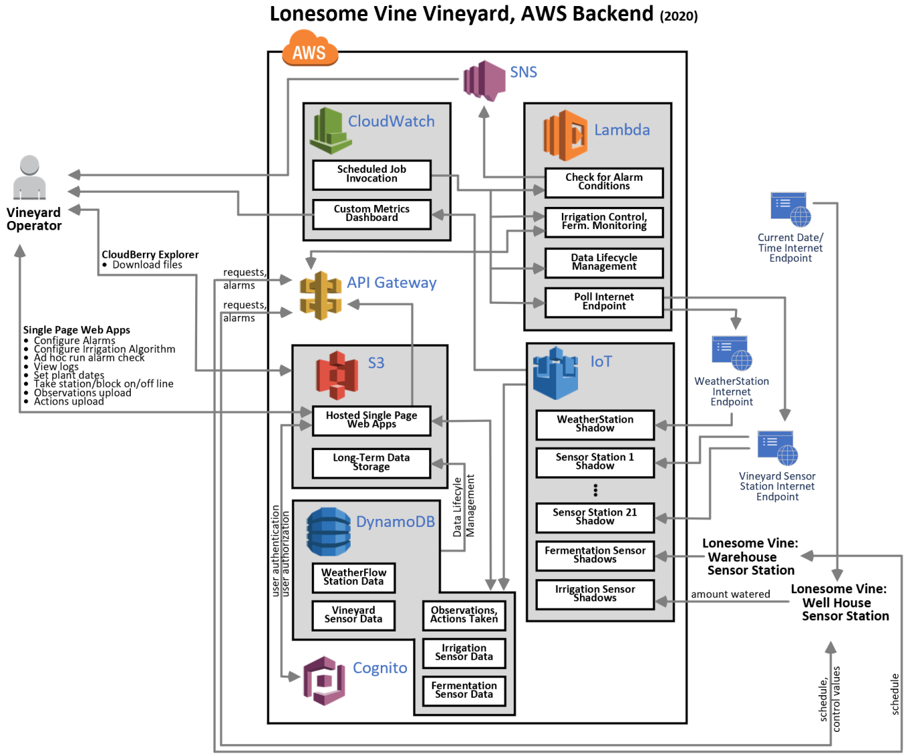
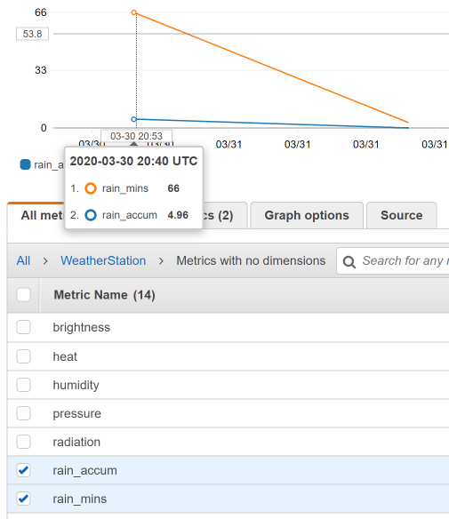
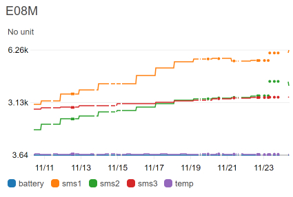
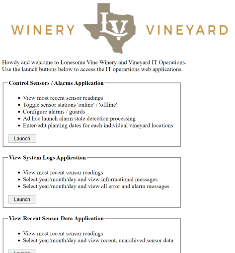
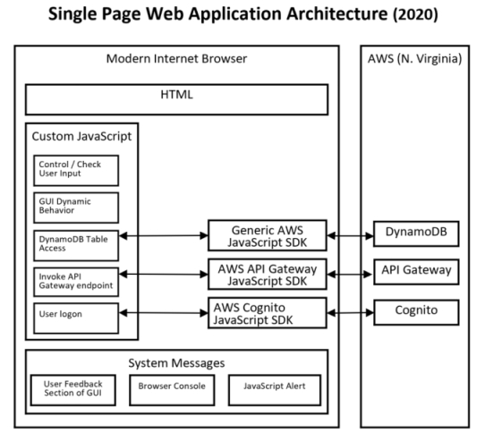
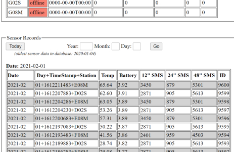
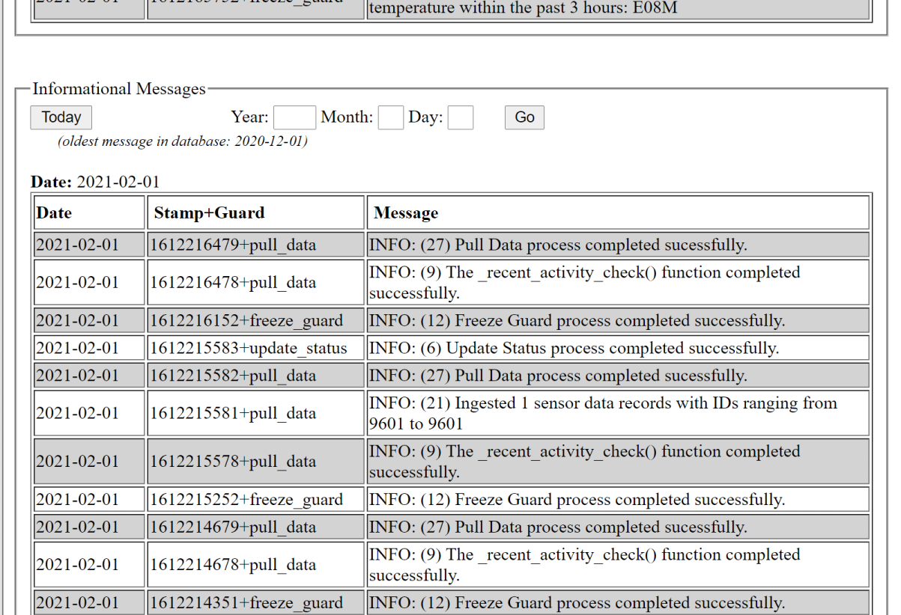

# Introduction
The solution's backend was implemented on the AWS public cloud.  The backend includes long-term data storage, processing logic, application / data security, communications, and a collection of single page web applications that provide vineyard operators the ability to interact with the solution in a number of ways. Backend data storage occurs in multiple formats across multiple AWS services.  

Python 3+ was selected as the programming / scripting language used on the backend.  Every attempt was made to write efficient, self-contained scripts.  Modules were imported when warranted but they were all sourced from either the Python 3+ Standard Library or from the set of modules that commonly accompany a standard Python 3+ install. I did not introduce a motley collection of Python modules that were not purpose-built for the problem I used them on and / or over kill for that problem, thus introducing a uneccessarily large footprint. 

Single page web applications, that provide vineyard operators the ability to interact with the solution in multiple ways, were written using HTML 5 and JavaScript.  This technology choice fulfills the design principle of enabling vineyard operators to interact with the solution using any modern, standard browser.

# Design Considerations and Principles
* 100% serverless
* 100% idempotent, RESTful APIs
* AWS provides long-term storage for all solution data (with exception of PI 4 information level system logging)
* Maximally concentrate the overall solution's processing logic (and long-term data storage) onto the AWS backend, away from other platforms (e.g., sensor stations, web browsers, third-party service providers).
   * Leverages AWS strengths: availability, feature-rich managed services, powerful service-to-service integrations
   * Removes processing logic from non-AWS platforms reducing their complexity.  Lower complexity leads to higher reliability and simplified deployment / maintenance /trouble shooting.
* Data communications
   * All sensor data ingestion achieved using AWS IoT Core
   * AWS API Gateway provides APIs for
      * Requesting irrigation schedule by Irrigation Control sensor platform
      * Requesting fermentation monitoring schedule by Fermentation Monitoring sensor platform
      * Alarm condition notification from Irrigation Control sensor platform or Fermentation Monitoring sensor platform
      * Ad hoc invocation of alarm detection processing on the "at the vine" sensor data 
* Single page web applications directly access AWS DynamoDB tables for
   * Alarm configurations for "at the vine", irrigation, and fermentation sensor data
   * Configuration of intelligent irrigation algorithm
   * Configuration of fermentation monitoring
   * Ad hoc data entry for plant ages, actions taken, and observations

# Overall Architecture
The diagram above provides a high-level, logical architecture diagram.


The backend, supporting all aspects of the solution, was constructed within a single AWS account.  Resources were provisioned in a single AWS region in relatively close proximity to the vineyard and winery.  All sensor data is ingested via IoT Core regardless of a sensor platform's inherent capacity to directly communicate with IoT Core.  Vineyard operators are free to use any modern Internet browser of their choice to view sensor data, view system logs, perform ad hoc data uploads, download historical sensor data, configure alarms, configure the irrigation algorithm, and configure fermentation monitoring.  

# Initial Set Up
All manner of information regarding the basic set up of an AWS account, working with AWS services, setting up AWS service-to-service integration, and invoking AWS services programmatically can be sourced at www.aws.amazon.com, as well as a number of sources discoverable from general Internet searching.

As the target audience of this repository possesses a moderate degree of programming skill and an intermediate level of AWS experience, this section will not provide the sort of detailed, step-by-step guidance appropirate to a beginner's guide.

## AWS Services
I selected an AWS region relatively close to the vineyard and winery and used this region when provisioning and configuration AWS resources that require a regional designation.  I used the AWS console to provision, configure, and integrate the AWS servcies contained in the solution.  The AWS console also serves as a component of the solution (e.g., end user access to custom CloudWatch metric dashboards).

### API Gateway
The API Gateway service was utilized in the solution to support four different areas.
* Accept ad hoc data input (e.g., plant age, actions taken, observations)
* Ad hoc invocation of scripts to detect alarm conditions (i.e., vs scheduled execution of alarm state detection)
* Inbound notification of alarm state condition (i.e., detected by an external platform such as irrigation control)
* Service requests for information (e.g., irrigation control platform requesting up-to-date irrigation schedule)

All of the solution's API Gateway endpoints invoke Lambda functions written in Python 3+.  Additional information on these scripts, including source code, is documented elsewhere in this document.  Additional information regarding the invocation of the solution's API Gateway endpoints is documented in several locations in this document. 

The AWS console was used to create individual API endpoints.
* REST APIs (not REST API Private) of the "Regional" endpoint type
* Each API was configured with the 'GET' method passing query string parameters through to the appropriate backend Lambda function.
   * Creating the backend Lambda functions beforehand enabled a more straightforward, streamlined creation process for the API Gateway endpoints.  
   * In most cases the default settings in the AWS Console were used
   * CORS was enabled for all methods of all APIs
* All APIs are secured using an Authorizer, of type Request (because query string parameters are passed).  Using the AWS Console, this will prove to be a more straightforward, streamlined process if you create the Authorizers (i.e., Lambda functions) before you secure the APIs.

API Gateway APIs are secured using an Authorizer written in Python 3+.  These Authorizers examine the value of a specific query string parameter named 'user,' contained within the in-bound request, to make a decision to either allow or to deny a request.  Authorizers allow access if the value of the query parameter is contained within a short list of user ids that is hard coded into the source code of each Authorizer.  This short list is the complete list of all user ids, provisioned for all of the vineyard operators; contained within a user pool defined within the AWS Cognito service.  This user pool is leveraged to secure access to the solution's single page web applications.  As there are only three vineyard operators, and this is not expected to ever change, this hard coded approach is sufficient.

A snippet of Python 3+ code from one of the solution's Authorizers.  All of the solution's Authorizers are very similar.

```
import re

authorizedUsers = ['operator1_user_id', 'operator2_user_id', 'operator3_user_id']

def lambda_handler(event, context):
  """
  Execution entry point
  """
  tmp = event['methodArn'].split(':')
  apiGatewayArnTmp = tmp[5].split('/')
  awsAccountId = tmp[4]
  principalId = event['queryStringParameters']['user']
  policy = AuthPolicy(principalId, awsAccountId)
  policy.restApiId = apiGatewayArnTmp[0]
  policy.region = tmp[3]
  policy.stage = apiGatewayArnTmp[1]
  if(principalId in authorizedUsers):
    policy.allowMethod(HttpVerb.GET, '*')
    policy.allowMethod(HttpVerb.OPTIONS, '*')
  else:
    policy.denyAllMethods()

  authResponse = policy.build()
  
  return(authResponse)

class HttpVerb:
  GET     = 'GET'
  POST    = 'POST'
  PUT     = 'PUT'
  PATCH   = 'PATCH'
  HEAD    = 'HEAD'
  DELETE  = 'DELETE'
  OPTIONS = 'OPTIONS'
  ALL     = '*'

class AuthPolicy(object):
  """
  Internal lists of objects representing allowed and denied methods.
  Each object has 2 properties: a resource ARN and a conditions 
  statement (which can be null). The build method processes these 
  lists to generate the final policy.

  """
  awsAccountId = ''
  principalId = ''           # email of user attempting to invoke API
  version = '2012-10-17'
  pathRegex = '^[/.a-zA-Z0-9-\*]+$'   # pattern for valid resource paths 

  allowMethods = []
  denyMethods = []

  restApiId = '*'
  region = '*'
  stage = '*'

  def __init__(self, principal, awsAccountId):
    self.awsAccountId = awsAccountId
    self.principalId = principal
    self.allowMethods = []
    self.denyMethods = []

  def _addMethod(self, effect, verb, resource, conditions):
    """
    The condition statement can be null.
    """
    if((verb != '*') and (not hasattr(HttpVerb, verb))):
      raise NameError('Invalid HTTP verb ' + verb + 
                      '. Allowed verbs in HttpVerb class')
    resourcePattern = re.compile(self.pathRegex)
    if(not resourcePattern.match(resource)):
      raise NameError('Invalid resource path: ' + resource + 
                      '. Path should match ' + self.pathRegex)

    if(resource[:1] == '/'):
      resource = resource[1:]

    resourceArn = 'arn:aws:execute-api:{}:{}:{}/{}/{}/{}'.format(
                                                            self.region, 
                                                            self.awsAccountId, 
                                                            self.restApiId, 
                                                            self.stage, verb, 
                                                            resource)
    if(effect.lower() == 'allow'):
      self.allowMethods.append({'resourceArn': resourceArn,
                                'conditions': conditions})
    elif(effect.lower() == 'deny'):
      self.denyMethods.append({'resourceArn': resourceArn,
                               'conditions': conditions})


  def _getEmptyStatement(self, effect):
    """
    Returns an empty statement object prepopulated with the correct 
    action and the desired effect.
    """
    statement = {'Action': 'execute-api:Invoke',
                 'Effect': effect[:1].upper() + effect[1:].lower(),
                 'Resource': []}
    return(statement)

  def _getStatementForEffect(self, effect, methods):
    """
    Loops over an array of objects (each containing a resourceArn and 
    conditions statement [which may be null]) and generates an array of 
    individual statements for the policy.
    """
    statements = []

    if(len(methods) > 0):
      statement = self._getEmptyStatement(effect)

      for curMethod in methods:
        if((curMethod['conditions'] is None) or 
           (len(curMethod['conditions']) == 0)):
          statement['Resource'].append(curMethod['resourceArn'])
        else:
          conditionalStatement = self._getEmptyStatement(effect)
          conditionalStatement['Resource'].append(curMethod['resourceArn'])
          conditionalStatement['Condition'] = curMethod['conditions']
          statements.append(conditionalStatement)

      if(statement['Resource']):
        statements.append(statement)

    return(statements)

  def allowAllMethods(self):
    self._addMethod('Allow', HttpVerb.ALL, '*', [])

  def denyAllMethods(self):
    self._addMethod('Deny', HttpVerb.ALL, '*', [])

  def allowMethod(self, verb, resource):
    self._addMethod('Allow', verb, resource, [])

  def denyMethod(self, verb, resource):
    self._addMethod('Deny', verb, resource, [])

  def allowMethodWithConditions(self, verb, resource, conditions):
    self._addMethod('Allow', verb, resource, conditions)

  def denyMethodWithConditions(self, verb, resource, conditions):
    self._addMethod('Deny', verb, resource, conditions)

  def build(self):
    """
    Generates the policy document based on the lists of allowed and 
    denied conditions. Generates a policy with two main statements for
    the effect: one for Allow and one statement for Deny.  Methods that 
    include conditions will have their own statement in the policy.
    """
    if(((self.allowMethods is None) or (len(self.allowMethods) == 0)) and
       ((self.denyMethods is None) or (len(self.denyMethods) == 0))):
      raise NameError('No statements defined for the policy')

    policy = {'principalId': self.principalId,
              'policyDocument': {'Version': self.version,
                                 'Statement': []}}

    policy['policyDocument']['Statement'].extend(
      self._getStatementForEffect('Allow', self.allowMethods))
    policy['policyDocument']['Statement'].extend(
      self._getStatementForEffect('Deny', self.denyMethods))

    return(policy)
```

### CloudWatch
The solution leverages two AWS CloudWatch service features: 
* Metrics
* Scheduled invocation of AWS Lambda functions

All sensor data ingested into the solution routes through IoT Core by updating an IoT Core shadow document.  There is a one-to-one correspondence between real-world devices and IoT Core shadow documents.  Within CloudWatch, a custom dashboard was created for each sensor.  An IoT Core to CloudWatch service-to-service integration exists for every sensor.  As such, when sensor data arrives in IoT Core the data is automatically sent to CloudWatch to become a new data point for the corresponding custom dashboard. Custom dashboards were created for the "general weather" conditions sensor platform, each of the 21 "at the vine" sensor platforms, the irrigation control sensor platform, and the fermentation monitoring sensor platform.

Screen shot of the CloudWatch custom dashboard for the "general weather" sensor stations.



Screen shot of a CloudWatch custom dashboard for the E08M "at the vine" sensor station.  



AWS CloudWatch Events Rules provide basic scheduling functionality.  This functionality is leveraged to invoke Lambda functions, written in Python 3+,  to both curate data and to detect the presence of alarm state conditions.  If an alarm state is detected a message is placed on an SNS topic that is subscribed to by all vineyard operators.

### DynamoDB
All of the solution's data is stored in either a DynamoDB table or an S3 bucket.

I designed the DynamoDB tables to support efficient, streamlined programmatic access.  In several cases I decided to employ compound values for Attributes in order to meet this design goal.  Compound values are composed of two or more independent concepts / values that are connected using a special character that, in itself, does not represent data (e.g., '+').   With the exception of the Attributes used as a TTL (i.e., time to live) setting, all Attribute values are stored as type String.

Overall, the amount of data generated / managed by the solution is relatively small by modern application standards.  By far, the "at the vine" sensor stations generate most of the solution's data.  Across all 21 of these stations, no more than 37K bytes of data is created / ingested on a daily basis (i.e., 24 records a day for each station).  On a monthly basis, raw sensor data is extracted from DynamoDB tables and archived into S3 buckets in CSV file format.  The length of time that raw sensor data remains in DynamoDB tables before archival into S3 buckets is configurable.  

System log messages for processing that occurs on the AWS platform is stored in DynamoDB tables.   
By far, processing for "at the vine" sensor data generates the largest number of system logging messages.  Of this, the majority of space is consumed by informational / warning level messages.  All data inserted into the DynamoDB table supporting informational / warning level messages is done with a TTL (time to live) value so that aging data will be automatically purged.  This TTL value used on table insertion is configurable.  In practice, the DynamoDB table used for informational / warning level messages rarely exceeds 3M bytes in size.  

The DynamoDB Tables used in the solution include:
* Vineyard: Smart Home Sensor Station
  * __WeatherStation__ – raw sensor data readings
* Vineyard: Vinduino R3 Sensor Stations
  * Sensor Data
    * __VinStationsData__ – raw sensor data readings
    * __VinstationsStatus__ – the most current sensor data per station
    * __VinStationsArchive__ – statistics to assist data archival process
  * Control
     * __VinStationsControl__ – alarm settings, misc values that assist overall processing
  * Logging
     * __VinStationsBackendInfo__ – informational and warning messages
     * __VinStationsBackendError__ – issue and error messages
* Irrigation
  * Sensor Data
     * __IrrBlockData__ – raw block data
     * __IrrBlockStatus__ – the most current block data
  * Control
     * __IrrBlockControl__ – alarm settings, misc values that assist overall processing
     * __IrrSchedules__ – irrigation control schedules
  * Logging
     * __IrrBlockBackendInfo__ – informational and warning messages
     * __IrrBlockBackendError__ – issue and error messages
* Fermentation
  * Sensor Data
     * __FermTankData__ – raw sensor tank data readings
     * __FermTankStatus__ – the most current sensor data per tank
  * Control
     * __FermTankControl__ – alarm settings, misc values that assist overall processing
     * __FermSchedules__ – fermentation monitoring schedules
  * Logging
     * __FermTankBackendInfo__ – informational and warning messages
     * __FermTankBackendError__ – issue and error messages

### Cognito
The solution leverages a single user pool and a single identity pool, both defined within the AWS Cognito service.  The user pool manages user id / password logon functionality allowing vineyard operators to access the various secure single page web applications.  This Cognito user id / password is separate and distinct from the IAM user id / password provisioned for each vineyard operator. The identity pool is used to manage the permission levels (i.e., access to AWS resources) granted to users defined in the user pool.  At this time, all vineyard operators enjoy the same access level and are all members of a single IAM Group.  

The AWS Console was used to set up the user pool and the identity pool.  When creating the user pool very few adjustments were made to the default settings.  A byproduct of creating an identity pool is the automatic creation of two "default" IAM Roles: one for authenticated users and one for unauthenticated users.  The default IAM Role for unauthenticated users was left in place.  It provides permissions for select actions in "mobileanalytics" and "cognito-sync."  Permissions were added to the default IAM Role for authenticated users to allow access DynamoDB and API Gateway (the single page web applications use SDKs to interact with these services.) 

Granting a new user access to the solution requires not only provisioning a new user in the Cognito user pool but also adding their Cognito user pool user id into the hard coded list of user ids maintained in the Authorizers that secure the API Gateway endpoints that are called by the single page web applications.

### IAM
Each vineyard operator is provisioned an IAM user account with both programmatic access (i.e., access key id and secret access key) and AWS Console access.  This IAM user id / password is separate and distinct from the Cognito user id / password provisioned for each vineyard operator.  To date, the access level for all operators is identical so their individual IAM accounts belong to a single IAM Group that grants read only access to S3, DynamoDB, and CloudWatch.  If a vineyard operator so chooses, their access key id and secret access key can be used to configure a local installation of CloudBerry Explorer to provide them with a Windows-File-Explorer-like interface to the S3 service.

Separate from the IAM Role associated with the IAM Group that all vineyard operators belong to (via their IAM user account), is an IAM Role that supports vineyard operators when they log into the Cognito user pool in order to access the single page web applications.  This role provides permission levels that include access to the DynamoDB and API Gateway services. 

### IoT Core
The solution uses the AWS IoT Core service to support sensor data ingestion from all data sensor platforms.  At present this includes (21) Vinduino R3 Sensor Stations, a single WeatherFlow Smart Home Sensor Station, and (2) PI 4 (hereafter referred to as PI 4).  The PI 4s, deployed indoors, engage in two-way communication with the AWS backend as they perform relatively more complex functions than the other data sensor platforms.  The R3 Sensor Stations and the Smart Home Sensor Station engage in one-way communication that flows from the sensor platform through an intermediary platform to the AWS backend.

As all of the solution's sensor data routes through IoT Core, an IoT  Core "Thing" was created for each sensor station platform.  This involved creating an IoT Core "Shadow Document" for each sensor station platform.  An IoT Core "Type" was defined to capture attributes for individual devices.  For example, R3 sensor station devices are of Type "SensorStation" and their StationType attribute is set to "VineyardStation."  The physical location, within the vineyard, of R3 sensor stations is designated using a Lonesome Vine-specific, 4-character code (e.g., A02N).  

Sensor data is routed to IoT Core by placing the data on an MQTT queue.  Placing a message on the MQTT queue requires use of a private key and a digital certificate during the crafting of the message.  Within IoT Core, during the creation of a Thing you are presented with the opportunity to have a key pair and digital certificate provisioned for you by AWS.  Alternatively, you can elect to provision your own security credentials and associate them with your sensor platforms as you create a Thing for each of them.

Following design principles, the solution leverages AWS service-to-services integrations to the fullest extent possible.  This is most evident within the solution's use of the IoT Core service.  When a sensor station submits sensor data for ingestion into the AWS backend it does so by updating its IoT Core Shadow Document.  This update triggers the following AWS service-to-service integration actions:
* The sensor station's CloudWatch dashboard is updated with a new data point
* A new Item is added to the appropriate raw sensor data DynamoDB table
* The appropriate station / block / tank status record in the appropriate DynamoDB table is updated.  For this integration AWS Lambda is employed because you cannot update a preexisting DynamoDB Table Item with a built-in IoT to DynamoDB service integration. 

When establishing the AWS service-to-service integrations, I configured the built-in run-time error handling mechanism.  If an error occurs during the execution of a service-to-service integration an object is placed into a special purpose S3 bucket.  Event Notifications are defined to push a message onto an SNS topic to alert vineyard operators that an AWS service-to-service integration has just occurred.

### Lambda
Python 3+ was used to write all of the solution's AWS resident processing logic.  For the most part, AWS Lambda default settings (e.g., memory, timeout) were left in place and the IAM execution role provides access to the DynamoDB and SNS services.  At a high-level the AWS resident logic includes: Authorizers for API Gateway endpoints, processing behind API Gateway endpoints, curation of raw sensor data, assistance with AWS service-to-service integrations, and assistance with raw sensor data ingestion.  

The design principles employed for all Python modules included in the solution include:
* Small, self-contained footprint
* Import a module only when it makes sense
   * Use Python standard library modules whenever possible
   * If a need cannot be met by a standard library module, use a module present in the standard Python 3+ installation
   * If a need cannot be met by the standard library or any module present in the standard Python 3+ installation, import a suitable third-party module and write a custom solution if a suitable one cannot be found.

The effort required to productize all Python modules was invested.  The modules were taken beyond code that works to code that is also well structured, efficient, and easy to troubleshoot / maintain.
* Instrumented with system log messaging
* Interrogation of input parameters; no assumptions
* Use of "try" / "except" blocks for execution flow involving unpredictable data and calls outside of the local Python modules or custom modules contained in the solution (e.g., calls to AWS services)
* Explicit, easy to maintain code structure; being explicit is better than being cleverly cryptic

### SNS
Two SNS topics were created: one for vineyard alerts and one for winery alerts.  All vineyard operators subscribed to both topics via email and smart device SMS messaging.  All issues and errors that are uncovered by the solution's processing logic (e.g., Python modules, AWS service-to-service integrations) result in an error / issue message being placed on one of these SNS topics.

### S3
All of the solution's data is stored in either a DynamoDB table or an S3 bucket.  In addition, a single S3 bucket is configured as a web server to host all of the solution's single page web applications.  

The solution ingests raw sensor data through IoT Core, ultimately storing it in DynamoDB tables.  After the raw sensor data reaches a certain age it is archived off, in CSV file format, into S3 buckets.  Each of the solution's AWS service-to-service integrations is configured to capture run-time service integration errors.  This service-to-service integration feature places S3 objects into special-purpose S3 buckets should an integration error occur.  The special-purpose integration error buckets have versioning turned on as repeated occurrence of the same integration error will reuse the same object name and otherwise overwrite preexisting error condition details.  Irrigation control processing on the PI 4 platform, as well as the fermentation monitoring processing, will place submit any local data files it deems damaged into a special-purpose S3 bucket for the purposes of manual processing (i.e., root cause analysis and data salvage) by the system administrator.

In summary, S3 buckets are used to store a few basic categories of data.
* Archived data
* AWS service-to-service integration errors
* Damaged PI 4 local files
* Web server for single page web applications

## Integrating Services 
Following design principles, the solution maximizes the use of AWS service-to-service integrations.  This strategy reduces the amount of source code requiring maintenance.  Less source code translates into lower complexity and in turn lower maintenance / effort / cost.   In cases where a built-in service-to-service integration was not available an integration to Lambda was put in place along with a Lambda function to carry out the necessary integration processing.

## End Users (Vineyard Operators)
The solution has only one type of end user: vineyard operators.  Each vineyard operator is provisioned
* An IAM user account
  * Read only access to CloudWatch, S3, and DynamoDB
  * AWS Console access
  * Access key id and secret access key can be used to configure a local installation of CloudBerry to provide an alternative GUI to the AWS console for accessing S3 storage.
* An AWS Cognito user pool user account
  * The system administrator must manually maintain a hard-coded list of user ids in the source code of the Authorizes that allow/deny access to the API Gateway endpoints
  * All three vineyard operators have already been set up, it is anticipated that there will not be any new operators hired in the near future so this manual processing poses not issue.

# Software
This solution's backend software includes:
* Python 3+ scripts that
    * Support sensor data ingestion
    * Curate sensor data
    * Detect alarm state
    * Service data requests from irrigation control platform and fermentation monitoring platform
* Single page web applications – HTML 5, JavaScript libraries, custom JavaScript
* AWS service configurations (e.g., Cognito, IAM) and AWS service-to-service integrations

Source code for the vast majority of the solution's software is included in this repository.  Obviously, every single technical detail that contributes to the overall solution has not been documented in this repository.  For example, relatively little detail regarding the AWS service-to-service integrations is documented in this repository.

## Single Page Web Applications
Per initial design guidance, vineyard operators can gain access to the solution through any modern, standard web browser.  Therefore, the single page web applications were constructing using HTML 5 and JavaScript.  

For the most part, the solution's single page web applications are used to configure alarms / algorithms and to view data.  However, on rare occasions they are used for ad-hoc enter data (i.e., entering planting dates for vines, observations, and actions taken).
 


The single page web applications represent the only portion of the solution that engages in direct, programmatic access of solution's DynamoDB tables.  Access to these applications is enabled by user ids and passwords that are provisioned from an AWS Cognito user pool.   A few of the single page web applications invoke AWS API Gateway endpoints (e.g., request data, invoke alarm processing).  

Each single page web application has a user feedback section located at the top of the page, just under the vineyard and winery's company logo.  It is used to provide real-time feedback to the vineyard operator regarding the status of the input they provided to the application.  This is an especially important feature as calls to AWS services are asynchronous and Internet speeds vary from day to day.  This allows the vineyard operator to track the progress of their input / requests to the application.

When it comes to creating artistically pleasing / flashy web interfaces, I admittedly have little skill.  Per contract, I delivered a complete set of fully-functional single page web applications to my client.   The original plan that my client had was to have the user interfaces of these applications reworked by a firm specializing in web application development.  However, after working for a short time with the web interfaces that I delivered, my client decided that the rework was unnecessary.  I was very surprised by this as I find the web interfaces that I created stark, utilitarian, and requiring a bit too much vertical scrolling. This wound up costing me some billable hours working with the web development firm so I guess I should have delivered applications with convoluted, hard to use interfaces. :)

### Architecture
Architecture of single page web applications.



To create the single page web applications, it was necessary to source JavaScript SDKs to interact with the AWS Cognito service and the AWS API Gateway service.  Several AWS services can be accessed using the generic AWS JavaScript SDK (i.e., aws-sdk-2.331.0.min.js) but these two AWS services previously mentioned require their own dedicated SDK.  For the API Gateway service I used the AWS Console to generate eleven files for each API Gateway endpoint.  Ten of the eleven files were identical across all API Gateway endpoints.  I sourced the JavaScript SDK file for the Cognito service from www.npmjs.com.  This involved installing npm on my local machine and sourcing the SDK file (i.e., amazon-cognito-identity.min.js) from within npm installation files.  Back when I did this in 2017, this was the most direct path to source the SDK; perhaps there is a more direct or official way to source this SDK today.

In developing the custom JavaScript code for the single page web applications, I struck a balance between the need to limit the size of the JavaScript source code and creating explicit, easily maintainable code.  By using naming standards for groups of similar HTML elements, it was possible to dynamically control HTML elements (e.g., setting values, enabling / disabling) using simple JavaScript loops to iterate over them as a group.   This allows groups of HTML elements to be controlled without having to explicitly reference individual HTML element with a dedicated line of JavaScript code(i.e., in which the elements name is hardcoded). However, taken to the extreme this technique can result in cryptic JavaScript that is hard to maintain.

Programmatic access of AWS services through an SDK (e.g., by a single page web application) is, by design, asynchronous.  In other words, the browser running the AWS JavaScript SDKs spawn a separate process thread when they invoke an AWS service endpoint.  While the call to the AWS service is still executing the browser continues with execution of the next command in the script.  This is done without waiting for the final result from the call to AWS service endpoint.  Keeping with solution's design principles, no attempt was made to work against this "out of the box" behavior of the AWS SDKs.  Instead, the vineyard operators were educated as to the asynchronous nature of calls to the AWS backend and shown how to monitor the progress of those calls to AWS  by watching the user feedback section of the GUI.

### Inventory
The solution is supported by several single page web applications.
* Working with "at the vine" sensor data:
  * Control sensors / alarms
  * View sensor data for a given day
  * View system logs for a given day
  * Ad hoc data entry / edit
    * Plant dates
    * Observations
    * Actions taken
* Working with Irrigation Control:
   * Control Irrigation
     * Control irrigation mode
     * Configure irrigation controls per blocks
     * Configure alarms
     * Configure Intelligent Scheduling algorithm
     * Configure fixed schedule 
   * View irrigation schedule
      * Most current
      * One executing on PI 4 platform
   * View sensor data for a given day
   * View system logs for a given day (AWS platform logging only) 
* Working with Fermentation Monitoring:
  * Select fermentation monitoring schedule
  * Configure custom fermentation monitoring schedule
  * View fermentation monitoring schedule
  * Configure alarms
  * View sensor data for a given day
  * View system logs for a given day (AWS platform logging only)

A couple of screen snippets from the different single page web applications.


**accessing sensor data by date:** 




**accessing log files by date:**



### Source Code
For the single page web applications:
* You will find the source code in the following subdirectories:
  * [source-code/at-the-vine/single-page-apps](https://github.com/JayeHicks/ManageIrrigation/tree/master/backend/source-code/at-the-vine/single-page-apps)
  * [source-code/irrigation/single-page-apps](https://github.com/JayeHicks/ManageIrrigation/tree/master/backend/source-code/irrigation/single-page-apps) - currently in user acceptance testing
  * [source-code/fermentation/single-page-apps](https://github.com/JayeHicks/ManageIrrigation/tree/master/backend/source-code/fermentation/single-page-apps) - currently deployed as a proof of concept
* All require three SDKs
  * I've included the AWS Cognito SDK (i.e., amazon-cognito-identity.min.js)
  * The https://sdk.amazonaws.com/js/aws-sdk-2.331.0.min.js SDK can be picked up on demand.
  * I've included the AWS API Gateway SDK (i.e., apiGwy.zip)
    * I generated this SDK, for each application, using the API Gateway section of the AWS console
	* Feel free to use this SDK but be aware that only 10 of the 11 files are "universal" across different API Gateway endpoints.  The apigClient.js file is specific to a particularl API Gateway endpoint, but you could certainly modify it (e.g., take parameters) it to serve as many of your endpoints as you like. 

You will find the source code of the Python 3+ scripts behind the API Gateway endpoints, invoked by these single page web applications, in the subdirectories:
* [source-code/at-the-vine/alarm-control](https://github.com/JayeHicks/ManageIrrigation/tree/master/backend/source-code/at-the-vine/alarm-control)
* [source-code/irrigation/alarm-algorithm-control](https://github.com/JayeHicks/ManageIrrigation/tree/master/backend/source-code/irrigation/alarm-control) - currently in user acceptance testing
* [source-code/fermentation/alarm-control](https://github.com/JayeHicks/ManageIrrigation/tree/master/backend/source-code/fermentation/alarm-control) - currentnly deployed as proof of concept


See the System Logging section below for details on the system logging functionality for the single page web applications.

## Data Ingestion and Curation

### Vineyard
Vineyard sensor data originates from a single "general weather" conditions sensor station platform and from (21) "at the vine" weather conditions sensor station platforms and (2) PI 4 single board computers.  All sensor platform data is ingested into the AWS backend through the AWS service IoT Core.  For the "general weather" conditions sensor station platform and the "at the vine" conditions sensor station platforms, this is achieved using an AWS Lambda function to regularly poll the Internet endpoint receiving the raw sensor data.  Sensor data from the PI 4 platforms is directly submitted to IoT by the PI 4s.

#### Architecture
Refer to the diagram in the "Overall Architecture" section of this README.md file.

Neither the "general weather" sensor platform nor the "at the vine" sensor platform are capable of directly sending data to the AWS IoT Core service.  As such, two CloudWatch Events Rules were set up to regularly invoke an AWS Lambda function to pull sensor data and route it to AWS IoT Core.  In the case of the "at the vine" sensor platform, a single rule collects data across all 21 station platforms.  The data ingested by IoT Core routes, via AWS service-to-service integrations, to various services within AWS.  In general, raw sensor data resides in a DynamoDB table and is archived off to an S3 bucket, in the form of combined monthly data files in CSV (comma separated values) format, for long term storage.

The "at the vine" sensor platform is slightly more flexible than the "general weather" sensor platform in that you can direct sensor data to any "http" endpoint.  In the future, should need arise, the firmware for this platform can be modified to send sensor data to an AWS hosted endpoint, thereby eliminating the third-party service provider that is currently poled to source the sensor data.  My client elected to scope out this effort from the initial delivery, mostly because a third-party service provider is unavoidable for the "general weather" sensor platform.  Additionally, there is currently no cost for the service provide used to relay the "at the vine" sensor platform data and alternative providers exist should this provider start charging a fee for their service.

By design principle, the solution stores all data on the AWS platform.  If coordination / control between two of solution's platforms (e.g., AWS, Irrigation Control sensor station) is required, the coordination is achieved using data communication messaging between the platforms.  Automated, data-driven control of irrigating the vineyard's blocks is an example of such coordination between two platforms.  In this particular coordination, the AWS platform maintains up-to-date (e.g., refreshed every minute) irrigation instructions; referred to, in different sections of this repo, as the irrigation schedule.  The PI 4 platform controlling the vineyard's irrigation activities continuously requests, from the AWS backend, an up-to-date irrigation schedule.  In this manner, a vineyard operator can control the PI 4 platform.  The steps involved would be: access a single page web application, make changes to irrigation control values, the AWS platform generates a new irrigation schedule, the PI 4 platform requests and receives a new irrigation schedule reflecting the changes made by the operator, the PI 4 directs irrigation activities consistent with the changes made by the operator. 

#### Inventory
The following scripts, written in Python 3+, serve to curate vineyard sensor data.  With the exception of direct_load.py and invoke_job.py, these scripts are invoked on a scheduled basis by a AWS CloudWatch Events Rule.  vineyard operators execute the invoke_job.py script on an ad hoc basis using a single page web application.
* archive_check.py   detect missing archives and archives that appear too small
* archive_data.py	archive raw sensor data that has exceeded age threshold
* delete_data.py	delete raw sensor data that has been archived
* pull_data.py		pull sensor data into AWS backend for Vinduino R3
* update_status.py	update an existing Item in a DynamoDB table
* weather_station.py	pull sensor data into AWS backend for Smart Home
* direct_load.py		manually inject sensor data into table; trouble shooting, maintenance

A function named recent_activity_check() is housed within the pull_data.py module.  It is worth noting here as it plays a distinct role in the data ingestion and curation process for vineyard sensor data.  It is invoked every time the pull_data.py module executes.  The function references a DynamoDB table to determine how much time has elapsed since any vineyard sensor data has been received.  An alarm condition is entered if the amount of elapsed time has exceeded the defined threshold (e.g., 120 minutes). 

The solution's vineyard data ingestion and curation scripts:
* The upcoming epoch time rollover in 2038 is noted but not explicitly handled
* In some instances a "try / except" block was used in which catching an exception (e.g., 404 file not found) is part of normal processing, and does not represent a processing error condition
* The update_status.py module was created to overcome current limitations of IoT Core to DynamoDB service-to-service integration

#### Source Code  
For the scripts responsible for data ingestion and curation of vineyard sensor data:
* The source code is located in the at-the-vine/source-code [folder](https://github.com/JayeHicks/ManageIrrigation/tree/master/backend/source-code/at-the-vine/data-ingest-curate)
* The compressed file MQTTLib.zip is the Python SDK that you need to be able to send data to the AWS IoT Core service

See the System Logging section below for details on the system logging functionality of the solution's data ingestion and curation functionality for vineyard sensor data.

### Irrigation and Fermentation
Architecturally and technically, Irrigation Control and Fermentation Monitoring are very similar.  So much so, both subsystems are documented in this single, combined section.  Sensor data for Irrigation Control originates from a dedicated PI 4 single board computer.  Sensor data for Fermentation Monitoring originates from a separate, dedicated PI 4 single board computer.  Unlike the "at the vine" and "general weather" sensor platforms, the PI 4 computers submit data directly to the AWS IoT Core service.  Once sensor data arrives at an IoT Core shadow document, AWS service-to-service integrations push the data to various components of the overall solution; namely DynamoDB and CloudWatch.  Data files deemed corrupt by a process executing on a PI 4 are submitted to a special purpose S3 bucket for manual intervention.  To date, no corrupt data files have been identified.

Keeping with design principles, the PI 4 platforms run plain-vanilla, "out of the box" Raspbian OS (i.e., Debian Linux).  No extraneous software was loaded onto the PI platform.  All Irrigation Control and Fermentation Monitoring support software was written in Python 3+.

#### Architecture
Refer to the diagram in the "Overall Architecture" section within this README.md.

The sensor station supporting Irrigation Control and Fermentation Monitoring is the PI 4 single board computer.  The PI 4 platform is much more flexible and powerful than the "at the vine" sensor platforms and the "general weather" sensor platform.  Among other things, PI 4s are capable of placing secure messages on an MQTT queue.  This gives them the ability to directly feed sensor data to the AWS IoT Core service.

#### Inventory
The following Python 3+ scripts serve to curate Irrigation Control sensor data
* irr_archive_check.py 	detect missing archive files and abnormally small archive files
* irr_archive_data.py	archive raw sensor data that has exceeded age threshold
* irr_update_status.py	update an existing Item in a DynamoDB table
* irr_recent_activity.py	detect if the elapsed time since last comms exceeds threshold

The following Python 3+ scripts serve to curate Fermentation Monitoring sensor data
* fer_archive_check.py 	detect missing archive files and abnormally small archive files
* fer_archive_data.py	archive raw sensor data that has exceeded age threshold
* fer_update_status.py	update an existing Item in a DynamoDB table
* fer_recent_activity.py	detect if the elapsed time since last comms exceeds threshold

The following Python 3+ scripts are invoked by processes that execute on the PI 4 platform.  The retrieval of schedules occurs on a scheduled basis and the reporting of errors occurs ad-hoc when the PI 4 process detects an alarm condition.
* report_irr_alarm.py	Irrigation Control or Fermentation Monitoring platform reporting alarm
* report_ferm_alarm.py Fermentation Monitoring platform reporting alarm
* get_irr_sched.py	Irrigation Control request/receive updated irrigation schedule
* get_ferm_sched.py	Fermentation Monitoring request / receive updated fermentation monitoring schedule

The solution's irrigation and fermentation data ingestion and curation scripts:
* The upcoming epoch time rollover in 2038 is recognized but not explicitly handled in the source code
* In some instances, a "try / except" block was used in which catching an exception (e.g., 404 file not found) is part of normal processing, and does not represent a processing error condition.

#### Source Code  
You will find the source code for the scripts supporting sensor data ingestion and curation for the solution's Irrigation Control and Fermentation Monitoring subsystems at:
* [source-code/irrigation/data-ingest-curate](https://github.com/JayeHicks/ManageIrrigation/tree/master/backend/source-code/irrigation/data-ingest-curate) - currently in user acceptance testing
* [source-code/fermentation/data-ingest-curate](https://github.com/JayeHicks/ManageIrrigation/tree/master/backend/source-code/fermentation/data-ingest-curate) - currently deployed in proof of concept

See the System Logging section below for details on the system logging functionality of the solution's data ingestion and curation functionality for the irrigation control and fermentation monitoring subsystems.

## Alarm Processing
###Vineyard
Individually, alarm detection algorithms can be turned on, turned off, or suspended for a set period of time.  After the suspension time period expires alarm detection processing automatically resumes.  Individually, the 21 "at the vine" sensor stations can be toggled between two states: "online" and "offline."  When a station is "online" its data will be considered by all alarm detection logic.  When a station is "offline" its data will not be considered by any alarm detection logic.  All data received from all sensor stations is ingested and stored irrespective of whether the station is currently in an online or offline state.

Thresholds,  sensor data shelf life, and other values considered by alarm detection algorithms are configurable.  Most of these can be configured by the vineyard operator using a single page web application, but a few require the system administrator to adjust them by setting the value of an Attribute in a DynamoDB table.  

For "at the vine" sensor data, the detection of an alarm state is conducting exclusively on the AWS platform, utilizing multiple AWS services.  Each alarm detection script is implemented in a separate Python 3+ module, as the vineyard operator can independently turn each alarm on / off.  

#### Architecture
Refer to the diagram in the "Overall Architecture" section of this README.md.

#### Inventory
There are two basic categories of Python 3+ alarm detection scripts
* Aspects of the script's algorithm can be configured by the vineyard operator via a single page application
  * absence_guard.py	     detect sensor stations that have stopped reporting data
  * battery_guard.py	     detect sensor stations reporting low battery levels
  * freeze_guard.py	     detect sensor stations reporting low temperature readings
  * moisture_guard.py	 detect sensor stations reporting low soil moisture sensor readings
  * invoke_job.py		invoke one of the alarm detection algorithms for "at the vine" data
* Aspects of the script's algorithm can be configured by the system administrator modifying DynamoDB tables
The following alarm detection Python 3+ script, and function, can be configured by a system administrator modifying
  * archive_check.py 		detect missing archive files and abnormally small archive files  
  * _recent_activity_check() a function within pull_data.py, to detect no comms with vineyard

Note: _recent_activity_check()  is not a Python 3+ module.  It is a Python 3+ function and when it finds a problem it does not generate an "error" level system log message.   Instead, it generates a "warning" level system log message.  See the Software / Data Ingestion and Curation / Vineyard / Inventory section above for additional information.

The solution's scripts for alarm processing on sensor data:
* The upcoming epoch time rollover in 2038 is recognized but not explicitly handled in the source code
* In some instances, a "try / except" block was used in which catching an exception (e.g., 404 file not found) is part of normal processing and does not represent a processing error condition.

#### Source Code
You will find the source code for alarm processing on vineyard data in the source-code/at-the-vine/alarm-control [subdirectory](https://github.com/JayeHicks/ManageIrrigation/tree/master/backend/source-code/at-the-vine/alarm-control)

See the System Logging section below for details on the system logging functionality for the solution's alarm processing for vineyard sensor data.

### Irrigation and Fermentation
Since alarm processing for Fermentation Monitoring and Irrigation Control are so similar they will both be covered in this single, combined section.

Alarm processing for Irrigation Control and Fermentation Monitoring occurs on the AWS platform and the PI 4 platform.

Alarm processing on the AWS backend
* Irrigation Control
  * Elapsed time since last request for up-to-date irrigation schedule has exceeded limit
  * Most recent soil moisture sensor data is outdated; impairs Intelligent Scheduling mode
* Fermentation Monitoring
  * Fermentation sensor data exceeds acceptable threshold
  * Elapsed time since last request for up-to-date fermentation schedule has exceeded limit
  * Elapsed time since last upload of fermentation data has exceeded limit

PI 4 alarm processing includes
* Irrigation Control
  * Elapsed time since date / time synchronization has exceeded limit
  * Observed flow rate exceeds acceptable deviation limit
* Fermentation Monitoring
  * Elapsed time since date / time synchronization has exceeded limit

#### Architecture 
Unlike alarm processing for Data Ingestion and Curation (which only occurs on the AWS platform) alarm processing for Irrigation Control and Fermentation Monitoring occurs on both the AWS platform and the PI 4 platform.  This complexity was introduced due to the unpredictability of connectivity between the vineyard and the AWS backend.  The split enables the PI 4 platform to continue to operate normally despite limited or no connectivity to the AWS backend.  The split introduces two system logging solutions for Irrigation Control and two for Fermentation Monitoring.   While the system logging systems in each pair are independent, they are linked with respect to error conditions (i.e., alarms).  When the PI 4 platform detects an alarm state condition it forwards this information, by invoking an API Gateway endpoint, to the AWS backend to enable the second system logging subsystem to record an error level system log message.

The Fermentation Monitoring subsystem differs from the Irrigation Control subsystem in two important ways.  First, it does not control physical equipment.  Second, the rate at which alarm conditions progress is much slower for Fermentation Monitoring (e.g., days vs minutes).  In consideration of the second difference, an architectural decision was made to conduct alarm detection processing for Fermentation Monitoring sensor data on the AWS platform.

#### Inventory
Python 3+ scripts implemented as Lambda functions invoked by CloudWatch Events Rules on schedule
  * Irrigation Control
     * irr_comms_guard		    -detect lack of comms from Irrigation Control PI 4
     * irr_moisture_guard		-detect lack of current soil moisture sensor data
  * Fermentation Monitoring
     * ferm_comms_guard	        -detect lack of comms from Fermentation Monitoring PI 4
     * ferm_ph_guard		    -detect issue with current pH readings
     * ferm_temp_guard		    -detect issue with current temperature readings

Python 3+ scripts implemented as Lambda functions invoked by invoking an API Gateway endpoint
  * alarm			            -process inbound alarm messages; Irrigation or Fermentation
  * Irrigation Control
    * irr_schedule_requ	        -request up to date irrigation schedule
    * irr_schedule_inuse	    -report id of the irrigation schedule in use by Irrigation Control PI 4
    * irr_gallons_disp	        -amount of gallons dispensed to a zone
  * Fermentation Monitoring
    * ferm_mon_requ	            -request thresholds and tolerances for fermentation monitoring
    * ferm_values		        -report fermentation monitoring sensor values

The solution's alarm processing scripts for irrigation control and fermentation monitoring:
* The upcoming epoch time rollover in 2038 is recognized but not explicitly handled in the source code
* In some instances, a "try / except" block was used in which catching an exception (e.g., 404 file not found) is part of normal processing, and does not represent a processing error condition.

#### Source Code
You will find the source code for the scripts responsible for alarm processing for irrigation control sensor data and fermentation monitoring sensor data in the subdirectories:
* [source-code/irrigation/alarm-control](https://github.com/JayeHicks/ManageIrrigation/tree/master/backend/source-code/irrigation/alarm-control) - currently in user acceptance testing
* [source-code/fermentation/alarm-control](https://github.com/JayeHicks/ManageIrrigation/tree/master/backend/source-code/fermentation/alarm-control) - currently deployed in proof of concept]

See the System Logging section below for details on the solution's system logging functionality within the alarm processing for irrigation control and fermentation monitoring.

## System Logging
Each of the solution's components that are capable of generating system log messages generate system logging messages.  To support system logging functionality across the entire solution,  six separate, independent system logging systems are incorporated into the solution.  Two sets of these six systems are nominally linked.

Inventory of System Logging Systems
* Processing that occurs on the AWS platform will log to one of three different system logging systems
  * System logging dedicated to processing "at the vine" sensor data
  * System logging dedicated to Irrigation Control processing.  Coordinated with PI 4 platform
  * System logging dedicated to Fermentation Monitoring processing.  Coordinated with PI 4 platform
* Processing that occurs on the PI 4 platform will log to one of two different system logging systems
  * System logging dedicated to Irrigation control processing. Coordinated with AWS platform
  * System logging dedicated to Fermentation Monitoring processing.  Coordinated with AWS platform
* Processing that occurs in a browser that is running any single page web application will log to single system logging system

System Logging System Implementation Details
* Processing that occurs on the AWS platform
  * Messages are stored in DynamoDB tables
     * One table dedicated to errors and serious issues
     * One table dedicated to warning and informational messages.  Automated curation.
  * Coordination with PI 4 platform
     * For Irrigation Control and Fermentation Monitoring processing
      * Error and serious issues messages logged on PI 4 platform are forwarded to AWS platform
  * AWS system-to-system integration errors are logged to a special purpose S3 bucket
  * Data files sent from PI 4 that are found to be corrupt are sent to special purpose S3 bucket
* Processing that occurs on the PI 4 platform
  * Messages are stored in PI 4 flat files
    * One file dedicated to errors and serious issues
    * One file dedicated to warning and informational messages.  Automated curation. 
  * Coordination with AWS platform
    * For Irrigation Control and Fermentation Monitoring processing
    * Error and serious issue messages logged on PI 4 platform are forwarded to the AWS platform
  * Data file determined to be corrupt are sent to special purpose S3 bucket
* Processing that occurs in a browser
  * For all single page web applications covering the entire solution ("at the vine" sensor data, Irrigation Control, and Fermentation Monitoring)
  * Messages are transient
    * Are not stored long-term
    * Are displayed to the vineyard operator in one or more of three browser locations
       * Into a "user feedback" location of the GUI (located toward the top of each single page web application)
      * Into the browser's console (accessible through the browser's developer tools)
      * Into a JavaScript alert box (modal dialogue box)

Five of the six independent system logging systems are implemented using almost the exact same Python 3+ source code.  They differ only in where system logging messages are stored.  Three use DynamoDB tables and two use flat files.  The two that use flat files are linked to a system logging system running on the AWS platform.  As Irrigation Control processing and Fermentation Monitoring processing both occur on two platforms (i.e., the AWS platform and the PI 4 platform), they each use two separate, but linked, system logging systems.  The linkage occurs when an error, or serious issue, is discovered by processing on the PI 4 platform.  In such instances the message is forwarded to the corresponding system logging system on the AWS platform.

I decided to create the custom, minimalistic system logging solution that is used for five of the six independent logging systems for two main reason.  First, it enabled me to inject the exact level of system logging functionality into my custom Python 3+ modules, nothing more and nothing.  Second, in the case with the AWS Platform implementation, the storage of system log messages in DynamoDB tables enabled me to leverage functionality built into the AWS services to automate the curation of system logging data.  The custom system logging solution requires the placement of two small functions, and a few global variables, into every Python 3+ source file module and the use of two DynamoDB tables or two local flat files.  One table, or file, is dedicated to informational / warning messages and the other is dedicated to issue / error messages.  Refer to the source code of any Python 3+  script and look for the functions _log_message() and _write_logs_to_databases(), or _write_logs_to_files(), as well as the global variables that support these functions.  

Be aware that my custom system logging solution requires special consideration when run on the AWS Lambda service.  When run on AWS Lambda you must initialize the values of the two dictionary global variables that are used to house the individual system logs.  As the AWS Lambda service keeps the container for previously executed Lambda functions around for a short period of time, just in case the same Lambda function is called again, you need to clear out these global variables to avoid picking up data from a prior execution of the script.

# Tips and Techniques
## Python
* When I last developed a large, complex software solution and leveraged the built-in exception handling mechanism of the language that I built it in, I found the mechanism lacking.  The messages were more in-line with the implementation of the language's compiler rather than with a program written in the language and in need of debugging.   As such my first approach when I wrote the solution's Python 3+ scripts was to provide my own "omniscient / descriptive" messages in the exception handling logic.  It didn't take long for me to realize that the messages provided by Python 3+ exception handling are actually very good.  Further, my messages actually masked exceptions that I didn't expect because when you catch an exception and provide your own message you will not see the original message unless you concatenate it onto the end of your own message.

## AWS Build Out, Initial Set Up 
* If you are setting up and working with an isolated AWS account, I suggest that you create billing alarms in CloudWatch for the expected monthly billing amount.  This can help you discover instances in which you fail to suitably manage provisioned resources. 

## AWS Services
### Lambda Functions
* The Lambda service leaves containers of previously executed functions up for a short period of time in hopes that the container can be reused for an upcoming execution of the same function.
  * This improves performance when the Lambda function is invoked more than once in a short period of time.
  * You must take this into account when designing your Lambda functions.  If you use global variables, you may need to initialize them in your Lambda function to clear out any residual value from a previous invocation of your Lambda function.

### IoT
* When you build an IoT Thing with the AWS Console
  * It can be useful to modify the default shadow document that is automatically generated for you.  As I had no use for the "desired" : "value" key/value pair, I removed it from the auto generated shadow document. I learned that with the AWS Console you only have one shot of removing it.  To do so, during creation you edit the auto generated shadow document and set the attribute to null.  Note: you need to use this exact string that follows, minus the single quotes enclosing it:  "desired" : null '.  Be especially careful, particularly during cut and paste operations with what you use for double quotes and for single quotes.  Ensure that they are completely vertical.  A single quote that is angled left to right is not a single quote.  A double quote that is angled right or left is not a double quote.
  * To have previously created the security policy that you want to use with the Thing.  As of 2020, these policies are contained within IoT and are not mixed with IAM policies.  As of 2020, the only time you can see the linkage between a Thing and it's security policy is when you create the Thing and attach the policy.  Not having the ability to view security policy associationed with existing Things can prove problematic.
* If you are using AWS service-to-service integration to push ingested sensor data to AWS services, be aware that limitations exist.  For example, I defined an IoT Core Thing that ingests over 10 discreet values for a single shadow document update.  When I attempted to integrate IoT Core with CloudWatch (i.e., a custom metric for a dashboard) I received some sort of weird error message making reference to "goldeneye" (this was early 2020).  As I had already successfully used this service-to-service integration with a different shadow document with fewer than 10 discreet values, I decided to break the single service-to-service integration into two separate integrations, each fewer than 10 discreet values.  The approach worked.

### DynamoDB
* In early 2020 I noticed the following strange behavior, but never got around time to investigating it.  
  * I noticed that when inserting an item into a Table that has a TTL attribute, and specified TTL value is less than one hour in the future, the item prematurely disappears.  It shows up for a few minutes after insertion but then prematurely disappears.  
  * Perhaps this is normal documented behavior, but seems odd to me.  I don't clailm to be a DynamoDB expert.  I certainly haven not read all of the available DynamoDB documentation.
* If you want to update a preexisting Item using an UpdateExpression you need to be aware of DynamoDB reserved words.
  * There are literally hundreds of them.  They include very common words, some of which are used by the average programmer to name variables (e.g., 'temp').  
  * What slowed me down for a little over an hours worth of head scratching was the simultaneous occurence of two things.
    * First, I successfully defined and used, for about a week, a table
    * Second, I successfully updated Attributes of existing Items on this table
	* The whammy moment was when I added code to update a different Attribute but the name of that Attribute was a DynamoDB reserve word.  
	* The error messages were a little cryptic but once you get an idea of what's going on its no big deal and there are multiple, easy ways to get around the reserve word issue in DynamoDB UpdateExpressions
 
* During development and debugging pay close attention to the statements that you use to add data to a Table.  Most NoSQL databases, DynamoDB included, are flexible and will not catch/flag situations in which you mistype an Attribute name.  Instead, your flawed update/insert statement will execute and the net result will be that you introduce a brand new Attribute. 

### Cognito
* When you use the AWS Console to create an identity pool, two default IAM roles will be generated for you: one for authenticated users and one for unauthenticated users.  You should use these roles as is.  If you do anything to them, add to them.  Being security conscious, I attempted to eliminate what little permissions existed in the role for the unauthenticated users, and my modifications introduced an error.  The permission level that exists in that role by default are necessary. 
* IAM Role for authenticated users
  * I find that the fastest way to develop a solution is to start with full permission levels to any service that I need to access
  * After I get the solution operational, I work on reducing permission levels to the bare minimum as a separate activity.  In this way I only have one place to look when things break because I took permission levels too low.

## AWS Service-to-Service Integration
* For each service-to-service integration that you incorporate into your production solution, set up an "Error action" that will fire if a run time integration error occurs.  
  * I believe that the most powerful and flexible of the available options is to place an object in a special purpose S3 bucket when integration errors occur
  * If you use an S3 bucket to catch integration errors I suggest
    * You set up S3 Event Notification that places a message on a SNS topic in the event that the integration error occurs
    * You turn versioning on for the bucket as a given integration error will reuse the same object name each time the integration error occurs
* You may encounter limitations that you will have to work around
   * You might not find every integration that you would like.  If you don't, then integrate the source of the service-to-service integration to Lambda and then have the Lambda function integrate to the target of the service-to-service integration.
   * Some integrations have size / number limits (see IoT section above) 
* When creating a service-to-service integration for the first time
  * Fully build out a complete "throw away" integration
    * Take notes along the way
    * Name everything that you can "delete me", or something similar, to make the clean up task a bit easier
  * Armed with newly gained knowledge from conducting the "throw away" integration 
     * You can build out integrations more efficiently and in a shorter amount of time because you will have pre allocated all of the resources required by each integration
     * You can use more meaningful names while creating your integrations.  This improves readability and reduces maintenance costs
  * Some integrations are flexible and forgiving in that they allow you to alter them post creation.  Some are completely inflexible.  Having all of the necessary resources pre allocated and being able to supply  meaningful names can be a big help for integrations that are not so flexible.

## Single Page Web Applications
* Using the API Gateway section of the AWS console, you can generate an SDK (Software Development Kit) to enable programmatic invocation of your AWS API Gateway endpoints.  
  * If you do this, the AWS Console will generate 11 JavaScript files for you; 11 files for each of your API Gateway endpoints.  Of these 11 files, only one files (i.e., apigClient.js) is specific to a given API Gateway endpoint.  
  * You can easily genericize this single unique file (e.g., accept parameters) so that it can support multiple API Gateway endpoints and obviously a single set of 10 files can be shared across all API Gateway endpoints.
* In order to invoke an AWS API Gateway endpoint securely you will need to supply the JavaScript file 'amazon-cognito-identity.min.js' to your program.  
  * In 2017, when I first had need of this SDK, I decided to source it from www.npmjs.com
  * In short, I installed npm on my local machine, downloaded the "AWS Cognito Identity SDK for JavaScript" bundle, and then located the file in my machine's local file system.
* I'm a true beginner when it comes to HTML + JavaScript development.  In the off chance that another novice is reading this
  * I manage the size of my JavaScript code by using naming standards for groupings of similar HTML elements.  This allows me to employ programmatic JavaScript iteration to dynamically set/change the values of groups of HTML elements.  
  * While this is a sound technique it should not be taken to the point of creating cryptic, hard-to-maintain JavaScript. 
* You can reduce your application support workload if you educate your end users.  A large number of issues can resolved by the end user if the follow these guidelines:
   * Only access the web application using a modern web browser.  Ensure that the browser is free of plugins, extensions, and all other end-user modifications
   * Have your end users segregate work browsers from personal browsers.  Only access the solution's web applications using a machine / browser combination in which the removal and reinstallation of the web browser poses no issue.  The removal and reinstallation of a personal use browser would certainly pose a problem for most.  In particular, it would remove cached values (e.g., convenient caching of your user id and password for sites that are visited on a regular basis) and would remove saved links unless they were saved to a local file and reimported after reinstallation.
   * Follow this trouble shooting protocol before raising a support request:
        * Shut down browser, bring up a new one and retry
        * Flush browser cache and retry
        * Reboot the machine and retry
        * De install the browser, reinstall it, and retry
        * If the end user is technically savvy, open the developer tool to diagnose> 
* Similar to a bullet above regarding end users, developers will benefit (especially when debugging security issues) by using a modern, standard web browser, on a platform where the browser's cache can be flushed and the browser can be reinstalled if necessary. Mixing your personal user browser and you development browser can introduce pain if you need to flush cache and / or reinstall.

## Observations at 7+ months of 24x7 Operations
* AWS services are, for the most part, solid.  However, I did notice a single unexplained blip in which a particular one of my AWS service-to-service integrations simply didn't work.  I had a manual procedure that I used to recover the approximate 4 hours of inbound raw sensor data.  
  * This was not a data issue as there was nothing unusual associated with the dropped data and it manually ingested just fine
  * This was not a configuration issue with the service-to-service integration as it had worked flawlessly for months before the 4 hour blip and have been working flawlessly since the blip
  * I reviewed the Personal Health Dashboard for the account that I used to develop / deploy the solution and found no mention of outages / disruptions with any services involved in the integration
  * I'm not quite sure where I would dig into this issue to do a root cause analysis
* In a similar vein but unrelated to the 4 hour service integration outage noted above, I have seen 3 integration error objects show up in the special purpose S3 bucket set up to catch any run-time service-to-service integration errors across all of the solution's service-to-service integrations.  
  * Considering the sheer volume of service-to-service integrations that run every single hour, this is a very low error rate and these three integration error blips did not result in the loss of any data.  
  * I think AWS service-to-service integrations are very powerful.  Definitely the way to go but they, like anything else in life, have their moments.  I've not had the spare time yet to forensically examine these S3 objects.
* An SNS topic has been set up to send emails and SMS text messages to vineyard operators in the event that an alarm state is detected.  All vineyard operators are subscribed to the topic with both an email account and a smart device telephone number for text messages.  For detected alarm states
  * Emails are received 100% of the time by 100% of the vineyard operators
  * SMS text messages are received by most vineyard operators, most of the time
  * My client, has asked me to focus on other issues so I have not dug into this one yet

## Enteprise-Level Considerations
* Applications that use date / time to coordinate processing must account for all of the different application's platforms that can introduce date / time information.  
  * Accounting for different time zones and United States daylight savings time can introduce complexity.  It may prove possible to simplify processing if you standardize on expressing time in UTC.
  * Executing something like the Python function datetime.now() on the different platforms contained in your solution can result in different return values.  For this solution, several platforms were involved.  Most platforms utilized UTC.
     * Remote sensors
     * Third party service providers (e.g., ISP, third-party remote sensor repository)
     * End user (e.g., laptop, smart device)
     * Networking equipment (e.g., WiFi router)
     * Backend (e.g., Lambda function)
  * Keep the previous bullet in mind when trouble shooting.  On more than one occasion I was briefly perplexed by the solution's behavior as evidence by system log messages and database table values. In this solution, data can be time stamped by a platform, sit on that platform for a period of time, and ultimately ingest into the AWS backend.  The time stamp applied to the data item by the first platform represents a time much earlier time than the time at which the item ultimately ingests into AWS.

* Prior to construction
  * The time and effort required to develop a comprehensive security architecture prior to construction is worth it.  Beyond doubt, the appropriate amount of security required by your solution will inform your solution's architecture.  If you retroactively try to implement security on a wide-open solution you will most likely have to engage in significant rework.   
    * In most cases simply following the security best practices, across all of the components incorporated by your solution, will suffice.  However, in some aspects of your solution you will need to engage in a business-driven security analysis (i.e., risk analysis / mitigation, cost / benefit analysis).
    * The security of a given solution is seldom a binary condition.  Generally, it's a spectrum ranging from "completely wide open" to "as secure possible."  
        * You inevitably wind up with an application that is as secure as you can make it with the time / budget available to you
        * As you follow the spectrum towards "as secure as possible" costs will rise in both effort / cost and ongoing processing requirements.  
         * Large, well-known corporations have no choice but to employ robust security architectures for any public facing solutions.  
         * Smaller, less prominent organizations can often get by with more modest security architectures but may regret this approach should they ever catch the interest of an Internet bad actor
         * Determining the right amount of security to put in place for a solution should be a business-driven exercise that requires honest, non-biased input from technical resources to business-focused decision makers
     * Attempting to retroactively put the right amount of security in place for an existing solution can prove difficult / expensive and in some cases impossible without an excessive amount rework
     * The beneficial impact of good operational practice (e.g., strong passwords, scheduled / proactive rebooting of networking equipment) should not be overlooked
   
  * Invest the time and effort necessary to conduct a single point of failure analysis.  
    * At the minimum you should inventory all of the major single points of failure and for each document the probability of failure, the expected loss of data, and the expected duration of system unavailability.  Beyond doubt, discussing your single point of failure analysis with your customer will inform your solution's architecture.  
    * I never cease to be amazed when a client dismisses what I think is significant and fixates on what I think is a nonissue.  Sometimes we educate one another; somethings we retain our individual, original positions.  
    * Over the years I've learned to not only have this conversation with the client but to document it and then inform the architecture with the direction captured by the final, review, approved document.
    * Attempting to retroactively address single points of failure in an existing solution can prove difficult and sometimes impossible
    * If you want to do more than the minimal amount of single point of failure analysis for your solution
      * Identify all single points of failure
      * Assess the risk posed by each (probability of occurring, impact if occurs)
      * For all high probability, high impact, and combination high probability / high risk
        * Develop risk mitigation strategy
        * For each risk mitigation strategy
          * Create a cost / benefit analysis 
          * Analyze for single points of failure and risk
