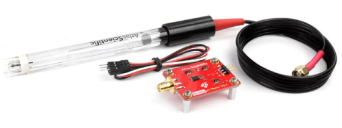

# Introduction
This is a marketing photo of the Raspberry PI 4 single board computer (hereafter referred to as "PI 4").


 
The PI 4 was selected as the hardware platform to support the solution's Fermentation Monitoring subsystem.  Deployed indoors, the PI 4 is powered by a combination uninterrupted power supply / surge protector unit.  It receives a reliable and strong WiFi signal from the vineyard and winery's wireless network.  In keeping with overall design principles, the PI 4 runs a "plain-vanilla" Raspbian OS install (i.e., Debian-based Linux variant) and the minimum of additional software has been installed. The PI 4's GPIO pins are connected to each fermentation tank's pH meter and temperature sensor.

The PI 4 serves as the hardware platform for both the Irrigation Control subsystem and the Fermentation Monitoring subsystem.  Architecturally and technically, the Fermentation Monitoring subsystem does not introduce anything that is not already present in the Irrigation Control subsystem.  As such, many of the sections in this README.md file refer the reader to the corresponding section of the README.md file contained in the irrigation folder of this repository. 

Still there are important difference between Irrigation Control and Fermentation Monitoring.  Fermentation Monitoring does not involve the physical control of device as does Irrigation Control (e.g., valve actuator).  The pace at which situations develop for Fermentation Monitoring (e.g., pH level trending up) is typically measured in days whereas the pace at which situations develop for Irrigation Control (e.g., overflow indicates flooding of a block) is typically measured in minutes or hours.  

The photo below is a marketing photo of the Atlas Gravity Analog pH Sensor / Meter and the Silver Chloride pH Probe that has been integrated into the solution to support Fermentation Monitoring.



The photo below is a marketing photo of the DS18B20 temperature sensor that has been integrated into the solution to support Fermentation Monitoring. 


At the time of this writing, the Atlas pH meter package and the DS18B20 temperature sensor are components of a Fermentation Monitoring proof of concept.  The pH probe and the temperature probe come in direct contact with a substance that is intended for human consumption.  In the United States, the production of any substance intended for human consumption is subject to federal, and potentially state, regulations.  Research is currently underway to determine if these probes meet government regulatory standards.

Python 3+ was selected as the programming / scripting language to support intelligent, automated  irrigation.  Every attempt was made to write efficient, self-contained scripts.  Modules were imported when warranted but they were all sourced from either the Python 3+ Standard Library or from the set of modules that commonly accompany a standard Python 3+ install.

# Design Considerations and Principles
* The PI 4 sensor station, responsible for Fermentation Monitoring
  * Enjoys an external, unlimited power supply however, prolonged power outages must be taken into account
  * Enjoys Internet access however, unpredictable availability and bandwidth must be taken into account 
* Minimize the amount of processing logic (i.e., fermentation monitoring software), and associated data, resident on the PI 4.  There are many good reasons for this decision.  A couple:
  * The AWS backend is far more reliable, has far more compute / storage capacity, and is far easier to access and to modify
  * Smaller and less complex software systems are generally more reliable and easier to troubleshoot / maintain 
* The PI 4 must engage in reliable two-way communication
  * With the AWS backend
     * Raise alarm when alarm an condition is detected
     * Regularly request / obtain an up-to-date fermentation schedule
  * Obtain a date / time synch from a trusted Internet endpoint
  * With an Internet-based service provider, enabling reverse proxy services to support remote logon to the PI 4
* The Fermentation Monitoring software loaded on the PI 4 must be highly reliable
* Data loss must be minimized (both temporarily stored sensor data and data destined for AWS backend)
  * A cost benefit analysis drove final architecture
  * A relatively small amount of data loss is acceptable.  This is not a mission critical (e.g., medical, financial) application; there will be no loss of life or financial penalty for a small amount of loss data  
* Temperature and pH level readings, for a given moment in time, are taken and transmitted to the AWS backend

# Architecture
Refer to the corresponding section of the README.md file in the **irrigation** [folder](https://github.com/JayeHicks/ManageIrrigation/tree/master/irrigation).

## Architecture Design
Refer to the corresponding section of the README.md file in the **irrigation** [folder](https://github.com/JayeHicks/ManageIrrigation/tree/master/irrigation).

### Maximize AWS, Minimize Raspberry PI 4
Refer to the corresponding section of the README.md file in the **irrigation** [folder](https://github.com/JayeHicks/ManageIrrigation/tree/master/irrigation).

### Durable Data
Refer to the corresponding section of the README.md file in the **irrigation** [folder](https://github.com/JayeHicks/ManageIrrigation/tree/master/irrigation).

### Data Integrity
Refer to the corresponding section of the README.md file in the **irrigation** [folder](https://github.com/JayeHicks/ManageIrrigation/tree/master/irrigation).

### Inter-Process Coordination
Fermentation Monitoring processing on the PI 4 platform is carried out by a single Python 3+ script invoked by the Linux cron utility on a regular basis.

## Infrastucture / Network
The diagram below is a logical infrastructure / network depiction of the solution's Fermentation Monitoring subsystem.


From a technology perspective, the largest operational challenge faced by the vineyard operators is maintaining reliable data communications.  The benefits of proactively rebooting all communications equipment on a scheduled basis has been presented to the client and all vineyard operators.  At present, this proactive rebooting process is conducted manually, by my client has committed to investing in an intelligent UPS (uninterrupted power supply) unit that can be programmed to cycle power to various pieces of equipment based on a defined schedule and can be remotely (i.e., over the Internet) directed to cycle power.

The PI 4 platform sits behind a NAT (network address translation) table within the vineyard and winery's ISP's (Internet Service Provider) modem.  This makes establishing a remote logon session to the PI 4 difficult.  Following design principles, an open source / commercial solution was put in place to enable remote log in session instead of creating a custom solution.

# Web Applications
A collection of single-page web applications, hosted in S3, are available to vineyard operators in support of Fermentation Monitoring.  They leverage multiple JavaScript SDKs (software development kits) to interact with the AWS backend.  The solution's security features route through an AWS Cognito SDK, data requests and alarm signals route through an AWS API Gateway SDK, and data insertion / modification requests route through an AWS DynamoDB SDK.  

In support of Fermentation Monitoring, a vineyard operator can access a single page web application to:  
* View current fermentation data
* View the current fermentation schedule
* Set the fermentation monitoring schedule mode (i.e., standard, custom, none)
* Define a custom monitoring schedule
   * Define interval setting for each sensor
   * Define unique interval settings for each tank
* Fermentation monitoring alarms
   * Turn alarms on / off
   * Configure alarms
     * PI 4 to AWS communication link
     * pH min /max level and data shelf life
     * temperature min / max level and data shelf life
* View fermentation data for a given date

Vineyard operators gain access to the single-page web applications using a standard web browser and their AWS Cognito user pool user id and password.  Data input (i.e., new data and modification of existing data) is achieved through the combination of custom JavaScript and multiple JavaScript SDKs.  More detailed information (i.e., architecture, source code) on the single page web applications can be found in the README.md file of this repository's top-level folder named "backend."

Screen capture snippet of a single-page web application that allows a vineyard operator to configure fermentation monitoring.


# Software
The Python 3+ script that supports fermentation monitoring will be loaded into the source-code [subdirectory](https://github.com/JayeHicks/ManageIrrigation/tree/master/fermentation/source-code) once final user acceptance testing has conclucded.  At the time of this writing, the Fermentation Monitoring subsystem is currently running as a proof of concept.

Fermentation Monitoring is supported by processing that occurs on the AWS platform as well as the PI 4 platform.  On the PI 4 platform, a single Python 3+ script is invoked on a regular basis by the operating system's cron utility.  This approach is more robust that initiating a long-running process at operating system boot time that is intended to run indefinitely.

## Alarms
Alarm state detection logic for fermentation related sensor data is executed on the AWS platform.  In keeping with design principles, the only alarm processing logic conducted on the PI 4 platform is kept to the bare minimum (i.e., logic that cannot execute on the AWS platform easily or without introducing additional data and processing to allow it to execute on the AWS platform vs the PI 4 platform).

AWS based alarms:
* pH level
* Temperature
* Communication link issue with PI 4 platform

PI 4 based alarms:
* Elapsed time since last date / time synch has exceeded limit

## System Logging
Refer to the corresponding section of the README.md file in the **irrigation** [folder](https://github.com/JayeHicks/ManageIrrigation/tree/master/irrigation).

## Algorithms 
The fermentation schedule directs the PI 4 processing logic when to conduct sensor measures.  The following pseudo JSON is a conceptual example of a fermentation schedule.
```
{{time: 0:00,  tank: 1, sensor: temp},
 {time: 0:00,  tank: 1, sensor: pH},
 {time: 0:00,  tank: 2, sensor: temp},
 {time: 0:00,  tank: 2, sensor: pH},
 {time: 12:00, tank: 1, sensor: temp},
 {time: 12:00, tank: 1, sensor: pH},
 {time: 12:00, tank: 2, sensor: temp},
 {time: 12:00, tank: 2, sensor: pH}}
```

The basic algorithm
* Clear out any residual communications from any prior invocations
* Synchronize date / time from a trusted Internet endpoint; raise alarm if appropriate
* Procure up-to-date monitoring schedule from AWS backend
* Reference monitoring schedule and conduct any due / over due measurements across all tanks
* Submit measurements to AWS backend
* Exit

# Tips and Techniques
Refer to the "Python" and "Linux" subsection of the "Tips and Techniques" section in the README.md file located in the **irrigation** [folder](https://github.com/JayeHicks/ManageIrrigation/tree/master/irrigation).
