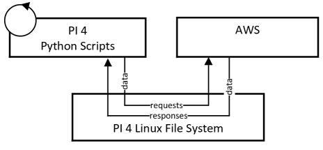
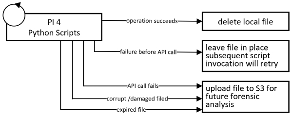
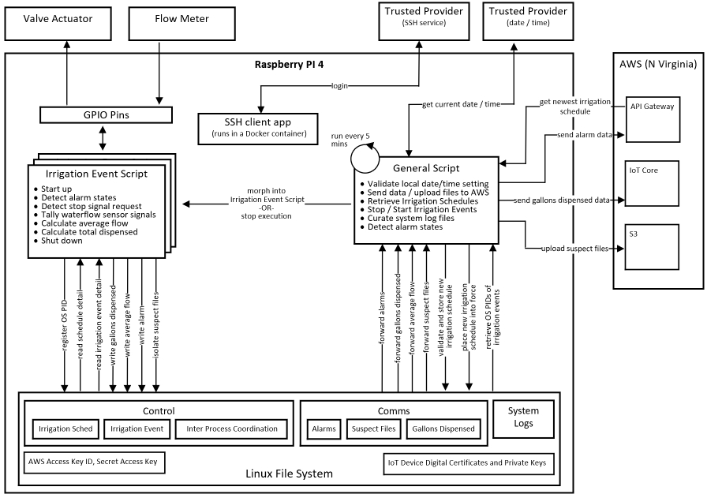

# Introduction
This is a marketing photo of the Raspberry PI 4 single board computer (hereafter referred to as "PI 4").


 
The PI 4 was selected as the hardware platform to support the solution's data-driven, automated Irrigation Control subsystem.  Deployed indoors, the PI 4 is powered by a combination uninterrupted power supply / surge protector unit.  It receives a reliable and strong WiFi signal from the vineyard and winery's wireless network.  In keeping with overall design principles, the PI 4 runs a "plain-vanilla" Raspbian OS install (i.e., Debian-based Linux variant) and the software installed on it was kept to a minimum. The PI 4's GPIO pins are employed for two functions: to control an 8-Channel Relay Module and to receive real-time input from a flow meter installed on the main water inlet from an irrigation well that serves the vineyard.

The photo below is a marketing photo of the 8-Channel Relay selected for use in this solution.  The high voltage AC side opens / closes individual valves plumbed into the 7 separate irrigation pipes routed to the vineyard's blocks (i.e., A � G).  The low voltage DC side is connected to the GPIO pins of the PI 4.


The photo below is a marketing photo of the flow meter used in this solution.  It is plumbed in-line from the irrigation well main water inlet before the fanout to the 7 irrigation blocks.  It is wired to GPIO pins on the PI 4.


Python 3+ was selected as the programming / scripting language that supports intelligent, automated  irrigation.  Every attempt was made to write efficient, self-contained scripts.  Modules were imported when warranted but they were all sourced from either the Python 3+ Standard Library or from the set of modules that commonly accompany a standard Python 3+ install.

# Design Considerations and Principles
* The PI 4 sensor station, responsible for Irrigation Control
  * Enjoys an external, unlimited power supply however, prolonged power outages must be taken into account
  * Enjoys Internet access however, unpredictable availability and bandwidth must be taken into account 
* Minimize the amount of processing logic (i.e., irrigation control software), and associated data, resident on the PI 4.  There are many good reasons for this decision.  A couple:
  * The AWS backend is far more reliable, has far more compute / storage capacity, and is far easier to access and to modify
  * Smaller and less complex software systems are generally more reliable and easier to troubleshoot / maintain 
* The PI 4 must engage in reliable two-way communication
  * With the AWS Backend
    * Raise alarm when alarm conditions are detected
    * Regularly request / obtain an up-to-date irrigation schedule
    * In support of a specific irrigation event
       * Signal beginning of irrigation event
       * Report total gallons dispensed at the end of an irrigation event
  * Obtain a date / time synch from a trusted Internet endpoint
  * With an Internet-based service provider, enabling reverse proxy services to support remote logon to the PI 4
* The Irrigation Control software loaded on the PI 4 must be highly reliable
* Data loss must be minimized (both temporarily stored sensor data and data destined for AWS backend)
  * A cost benefit analysis drove final architecture
  * A relatively small amount of data loss is acceptable.  This is not a mission critical (e.g., medical, financial) application; there will be no loss of life or financial penalty for a small amount of loss data  
* Remote access to the PI 4 from remote (beyond vineyard) locations
* Pulses from the flow meter are perishable; either catch them in real-time or loose the data

# Architecture
Unlike the Vinduino R3 Sensor Station and the Smart Home Sensor Station, the PI 4 is a general-purpose computer capable of serving as the sole platform for the solution's entire Irrigation Control subsystem.  That is, in and of itself, it is capable of storing all of the required data and executing all of the necessary algorithms to perform the Irrigation Control function.  This introduces architectural possibilities that are simply not present with the "at the vine" sensor platform and the "general weather" sensor platform.   

Unaided,  the PI 4 is not a suitable platform for solution's Irrigation Control subsystem for several reasons.  It represents a single point of failure and is limited with respect to long-term data storage and overall availability.  There is absolutely no comparison between the capabilities / capacity of a single, standalone PI 4 and the collective capabilities / capacity available with AWS services (i.e., availability, durability, storage capacity, compute capacity, long-term storage capabilities, support of vineyard operator access to data, and much more).  

A simple design of connecting relatively "dumb" sensors to an AWS backend, having the AWS backend store all data and conduct all algorithmic processing, is unsuitable due to the potential for interconnectivity issues between the sensors and AWS.  The data communications link between the vineyard and the outside world (i.e., Internet -> AWS) experiences unexpected outages of variable duration.  When the communications link is available, the effective available bandwidth can vary and do so into an unacceptable range.  A design directive requires continuation of normal vineyard operations, for a limited time, during Internet outages and periods of unacceptable bandwidth, making this design unsuitable.

The architecture of the solution's Irrigation Control subsystem blends the PI4 and AWS platforms.  A balance across both platforms was achieved such that the PI 4 executes algorithms autonomously yet remains informed and controlled by an AWS backend with the backend providing all long-term data storage.  Processing on the PI 4 platform commences with data supplied by the AWS backend, the processing is controllable by the AWS backend, and long-term storage for the data generated by processing on the PI 4 is provided by AWS services.  The autonomous nature of processing on the PI 4 platform addresses any interconnectivity issues (general availability and bandwidth limitations) between the PI 4 platform and AWS.  An effective way to characterize this architectural blending of platforms is "maximizing of data storage and processing on the AWS platform while minimizing it on the PI 4 platform."  More detail on this blending can be found below in the "Architecture Design" section below.

In keeping with design principles, the architecture of the solution's Irrigation Control subsystem
* Includes a minimum amount of components
* Technologies and components
    * Suited to task; purpose-built; not mutated; neither under-powered nor over-powered (with the exception of the PI 4 hardware)
    * Used "out of the box" with minimal modifications and extensions
    * Open source / commercial technologies; custom development employed as last option

## Architecture Design
Some of the architectural elements of the solution's Irrigation Control subsystem warrant high-level description.

Logical, high-level Raspberry PI 4 platform sensor data ingestion path.


### Maximize AWS, Minimize Raspberry PI 4
The solution's Irrigation Control subsystem operates across the PI 4 platform and the AWS platform.  Connectivity between the two platforms can be interrupted for unpredictable periods of time.  Autonomous (i.e., no communication with AWS required) Irrigation Control processing on the PI 4 is possible because it receives data and control parameters, from the AWS backend, prior to initiating execution and it eventually transmits sensor data to the AWS backend.  While engaged in Irrigation Control processing, the PI 4 can be interrupted and redirected by input received from the AWS backend after initially commencing processing.  

The amount of data and processing resident on the PI 4 is minimized to what is required for autonomous processing.  Sensor data residency on the PI 4 is temporary and the scripts that enable processing on the PI 4 are configurable through control parameters retrieved from the AWS platform on a regular, scheduled basis.

System logging functionality is in place for the solution's Irrigation Control subsystem.  This system logging, as well as the system logging for the solution's Fermentation Monitoring, is the only case of data and processing that exists independent of the AWS platform. More detail on Irrigation Control system logging can be found below.

The architectural blending of the PI 4 and AWS platforms can be illustrated with the diagram below.  In this scenario the execution of an irrigation schedule, generated by the solution's "Intelligent Scheduling" mode, is interrupted by a vineyard operator.  The operator accesses a single page web application and takes zone A "offline," rendering it ineligible for irrigation.  The next "driest" zone (as determined by current soil moisture sensor readings) in this scenario happens to be zone B.  Zone B is scheduled, by the AWS platform, for irrigation and will receive irrigation for the remainder of the time allocated to the irrigation event which commenced with the irrigation of zone A. 


### Durable Data
Unlike the dynamic data structures of a typical process executing on an operating system, the operating system's flat files generally survive unexpected operating system shutdowns relatively in tact.

During Irrigation Control processing on the PI 4, all important data (that cannot be easily recreated) is checkpointed to flat files.  Rather than a process simply creating a data structure and working with it, the process takes the additional step of regularly saving the state of its data structures to a purpose-built flat file.  Within Irrigation Control processes, file I/O writes are immediately followed by a call to flush the file I/O buffers.  Considering the processing power of the PI 4 relative to the amount of I/O overhead introduced by this design, no performance issues are introduced.  That is, the frequency of I/O calls, the average data size of each I/O call, and the overall complexity of the Irrigation Control scripts have no noticeable impact on the PI 4's resources.



All data destined for the AWS backend is stored in a flat file (e.g., sensor data, alarm state detected message).  A PI 4 regularly executing background script detects these data files, transmits them to AWS, and ultimately deletes the files for which it receives acknowledgement from the AWS backend.  Irregularities that might result from the AWS backend processing the same data message multiple times was mitigated by designing all AWS backend ingress points to be idempotent.


 
### Data Integrity
All local files used by Irrigation Control processes running on the PI4 include a hash value to help with data integrity validation.  Specifically, files contain both a data set and a hash value of the complete data set.  When working with a file, a process can quickly run the data set through the hash function and determine, to a reasonably high level of certainty, that the data set on hand is both complete and uncorrupted.  Corrupt files are not used.  Instead, they are transferred to a special purpose S3 bucket for manual analysis and potential data salvage.  To date, no corrupted files have been detected by the solution.  This data integrity validation scheme can be conducted on both the PI 4 platform as well as the AWS platform.

### Inter-Process Coordination
Irrigation Control processing on the PI 4 platform is carried by a single Python 3+ script.  The script is invoked on a regular basis by the PI 4's Linux cron utility.  This is far more reliable than invoking the script at operating system boot time and having it run indefinitely (i.e., sleep/wake/sleep...).  When invoked the script addresses general house-keeping activities and then transitions into irrigation management mode.  In irrigation management mode the script has the capacity to stop an irrigation event that is currently in progress and being supervised by a prior execution of the script.  If the script starts an irrigation event it will supervise that irrigation event until the scheduled conclusion of the event or until an inbound request from another execution of the script requests an orderly shutdown of the irrigation event.  

Supervision of an irrigation event involves opening the correct irrigation valve, counting all inbound sensor pulses from the water flow sensor, continuous monitoring for underflow and overflow conditions, continuous monitoring for orderly shutdown requests from other executing scripts, and sending "gallon dispensed" messages to the AWS backend (i.e., 1 gallon dispensed at the start of an irrigation event and total gallons dispensed at the conclusion of the irrigation event.)

The supervision of an irrigation event can run for hours.  During the same script will be executed, in a separate thread, numerous times (i.e., every 5 mins.)  In some cases a newly launched script will need to request a script that is supervising an irrigation event to shut down in an orderly manner (e.g., vineyard operator input via web application to terminate all irrigation.)  To achieve this the newly launched script will send a request to the script supervising the irrigation event.  If the request is not honored within the set time limit, the newly launched script will utilize an OS level kill command to take the supervising script down forcefully.
 
## Infrastructure / Network
A logical infrastructure / network diagram for the Irrigation Control subsystem of the solution.


From a technology perspective, the largest operational challenge faced by the vineyard operators is maintaining reliable data communications.  The benefits of proactively rebooting all communications equipment on a scheduled basis has been presented to the client and all vineyard operators.  At present, this proactive rebooting process is conducted manually, by my client has committed to investing in an intelligent UPS (uninterrupted power supply) unit that can be programmed to cycle power to various pieces of equipment based on a defined schedule and can be remotely (i.e., over the Internet) directed to cycle power.

The PI 4 platform sits behind a NAT (network address translation) table within the vineyard and winery's ISP's (Internet Service Provider) modem.  This makes establishing a remote logon session to the PI 4 difficult.  Following design principles, an open source / commercial solution was put in place to enable remote log in session instead of creating a custom solution.

# Web Applications
The solution includes a collection of single-page web applications, hosted in S3, to support Irrigation Control.  The applications leverage multiple JavaScript SDKs (software development kits) to facilitate interoperation with the AWS backend.  Security features route through an AWS Cognito SDK, data requests and alarm detection signals route through an AWS API Gateway SDK, and data insertion / modification features route through an AWS DynamoDB SDK.  

For Irrigation Control, a vineyard operator can work through different single page web applications to:  
* Configure overall irrigation settings
  * Select irrigation mode ("intelligent", "set", or "none")
  * View the current irrigation schedule
  * Determine which irrigation schedule is currently in place on the PI 4 platform
  * For a given vineyard block
     * Take the block in / out of consideration for all alarms
     * Take an irrigation in / out of consideration for irrigation when in Intelligent Scheduling mode
     * Define soil moisture thresholds
     * Define minimum required gallons dispensed to consider a location to have been irrigated
* Configure irrigation alarms
  * Individually, turn an alarm on / off
  * Set vineyard-wide thresholds for alarms
  * Set block-specific thresholds for alarms
* Configure irrigation schedules
  * Configure the Intelligent Scheduling algorithm
  * Define irrigation schedule for Set Scheduling mode

Vineyard operators gain access to the single-page web applications using a standard web browser and their AWS Cognito user pool user id and password.  Data input (i.e., new data and modification of existing data) is achieved through the combination of custom JavaScript and multiple JavaScript SDKs.  More detailed information (i.e., architecture, source code) on the single page web applications can be found in the README.md file in the **backend** [subfolder](https://github.com/JayeHicks/ManageIrrigation/tree/master/backend).

Screen capture snippet of a single-page web application that allows a vineyard operator to configure data driven algorithm that automatically controls vineyard irrigation.


# Software
The  complete set of Python 3+ scripts that support the solution's Irrigation Control subsystem will be loaded in the source-code [subdirectory](https://github.com/JayeHicks/ManageIrrigation/tree/master/irrigation/source-code) after final user acceptance testing concludes.  At the time of this writing final use acceptance testing is underway.

High-level conceptual application architecture of the solution's Irrigation Control subsystem.  See the "Algorithms" section below for implementation level detail.  While this high-level diagram can be useful, bear in mind that in reality a single script is executed on a fixed interval (i.e., 5 mins) and this script begins executing in a supervisory function and after performing this function may, or may not, transition to managing a single irrigation event.


Irrigation schedules are generated by the AWS backend.  When the script executing on the PI 4 first launches it reports information to the AWS backend (i.e., its perception of current date / time is and what schedule it is currently using) and requests the most up-to-date irrigation schedule.  Given a valid irrigation schedule (e.g., not expired) the PI 4 script can provide automated vineyard irrigation.  The script can continue this automated vineyard irrigation even when the communication like with the AWS backend is down.  In such a case, the data collected by the PI 4 script (e.g., gallons dispensed) is stored on the PI 4 until such time that it can be transmitted to the AWS backend.

There are two types of irrigation schedules: intelligent schedules and fixed schedules.  An intelligent schedule uses soil moisture sensor readings to prioritize the vineyard blocks by highest need for irrigation.  These schedule are date specific and are generated for a three day period in order to enable ongoing operations by the PI 4 script in the event that the communication link between the PI 4 and the AWS backend goes down.  I was able to convince the vineyard operator to establish a second communication link (i.e., beyond his Internet service provider) and to test that communication link out on a regular basis.  A fixed irrigation schedule is a set schedule that defines what vineyard blocks are to be irrigated (i.e., what day of week, what start time, what duration).

Example of an intelligent irrigation schedule.

```
{"whatami": "irrigation-schedule-intelligent", 
 "created_ts": 1234567890, 
  "created_date": "2021-10-31", 
  "id": 31, 
  "day1": {"date": "2021-07-31", 
           "events": [{"sequence": 1, "block": "a", "start": "8:00" "duration": "4:00", "exp_flow": 15, "over_flow_tol": 10, "under_flow_tol": 25}, 
                      {"sequence": 2, "block": "b", "start": "13:30", "duration": "4:00", "exp_flow": 15, "over_flow_tol": 10, "under_flow_tol": 25}]}, 
  "day2": {"date": "2021-08-01", 
           "events": "no-irrigation"}, 
  "day3": {"date": "2021-08-02", 
           "events": [{"sequence": 1, "block": "e", "start": "8:00", "duration": "4:00", "exp_flow": 15, "over_flow_tol": 10, "under_flow_tol": 25}, 
                      {"sequence": 2, "block": "f", "start": "13:30", "duration": "4:00", "exp_flow": 10, "over_flow_tol": 10, "under_flow_tol": 25}]}}
```
For any irrigation event two data messages are sent by the PI 4 platform to the AWS backend.  The first message is sent at the time that the irrigation event starts, reporting that a single gallon has been dispensed to the block.  This message updates a status table and ensures that intelligent irrigation scheduling algorithm running on the AWS backend will not schedule that block again for a period of 24 hours (i.e., a big design rule).  The second message is sent after the irrigation event has stopped, for any reason, providing the total number of gallons there were dispensed to the vineyard block.

The amount of water dispensed to a vineyard block during an irrigation event is tracked by the PI 4 script when it supervises the irrigation event.  Each pulse from the water flow sensor arrives on a PI 4 GPIO (General Purpose I/O) pin and the arrival of the signal invokes a function in the script to record the pulse.  The arrival frequency of pulses is used by the PI 4 script to detect over/under flow alarm states.  The total number of pulses is used to calculate the total number of gallons dispensed to a vineyard location.  The pulse count information is stored in a PI 4 flat file in order preserve it in the event of an unexpected PI 4 shutdown during an irrigation event.

Example of a pulse count file.  You can see that for this irrigation event two separate executions of the PI 4 script were involved in supervision.  The array of data points following the OS PID of the supervising PI 4 scripts.  So, in this example adding 10 and 20 results in 30 total gallons dispensed to the vineyard block "g" for this single irrigation event.


```
{"whatami": 
 "pulse_count", 
 "sched_id": 67, 
 "date": "2021-11-02", 
 "day": "sun", 
 "sequence": 1, 
 "block": "g", 
 "pulses": [{"123": [{"1234567890": 5}, {"1234568190": 10}]}, 
            {"456": [{"1234568490": 15}, {"1234568790": 20}]}]}
```

## Alarms
Alarm processing for solution's Irrigation Control subsystem occurs on both the AWS platform and the PI 4 platform.  Configuration values (e.g., flow tolerances) used by alarm processing algorithms executing on the PI 4 platform are present in irrigation schedules. 

AWS backend alarm processing
* Elapsed time since last PI 4 checked in
* The PI 4's perception of the current date / time is beyond acceptable tolerance
* Outdated soil moisture sensor data.  This data is provided by the "at the vine" sensor stations and is not directly related to the automated irrigation solution

PI 4 alarm processing
* Elapsed time since last successful data / time synchronization
* Flow rate; underflow / overflow detected

Real-time awareness of Irrigation Control alarms is a high priority for vineyard operators.  Under / over irrigation at certain critical times during the year can have a devasting impact to the quantity and the quality of a vineyard's grape production.  Vineyard operators can use a single page web application to customize the expected flow rate for each vineyard block in order to proactively detect irrigation issues in near-real-time.

## System Logging
See the System Logging section of the README.md file located in the **backend** [subdirectory](https://github.com/JayeHicks/ManageIrrigation/tree/master/backend) of this repository for a holistic treatment of the entire solution's system logging functionality.


For processing that occurs on the PI 4 platform, system logging data and processing is kept on the PI 4 platform.  If it were not for the potential for data communication issues between the PI 4 platform and the AWS platform (i.e., unavailability or unacceptable bandwidth), processing occurring on the PI 4 platform would submit system logging messages to the AWS backend for storage.  The data generated by processing occurring on the PI 4 platform represents the only data across the entire solution that is not stored in AWS.  Even though the PI 4 system logging system is independent of the AWS backend, it will forward a copy of any error message or serious issue message to the AWS backend for long term storage.

The PI 4 localized system logging system is virtually identical to the AWS-based system logging system that supports the "at the vine" sensor station processing.  The only difference between the two systems is that the PI 4 version stores system log messages in flat files while the AWS version stores messages in DynamoDB tables.  The flat files used for system logging are curated by automated processes that regularly trim off the oldest records contained in system log files.  By managing the file size, unacceptable file I/O performance, stemming from excessively large file sizes, is avoided.

The PI 4 localized system logging solution does not introduce a data fragmentation issue for the overall solution.  The system logging messages only pertain to the operational details of processing that occurs on the PI 4 platform.  Any errors or serious issues encountered by processing on the PI 4 platform will be reported to the AWS backend (i.e., invoking an AWS API Gateway endpoint).  

## Algorithms
The  complete set of Python 3+ scripts that support the solution's Irrigation Control subsystem will be loaded in the source-code [subdirectory](https://github.com/JayeHicks/ManageIrrigation/tree/master/irrigation/source-code) after final user acceptance testing concludes.  At the time of this writing final use acceptance testing is underway.

The following diagram provides a more detailed logical application architecture depiction than the previous diagram presented in the section above.  Remember that a single script is regularly executed on the PI 4 to provide automated vineyard irrigation.  Despite implementation realities, it is useful to depict two separate scripts in the diagram below.  While developing the script I discovered that the single script approach was architecturally cleaner, more reliable, and more portable across platforms (i.e., OS).



The following Python 3+ modules are used by the PI 4 script.

**alarms.py** - transmits all alarm data to AWS backend

**check_date_time.py** - obtains current date / time from trusted external endpoint (i.e., public Internet endpoint) and checks it against what the PI 4 believes to be the current date / time.  Returns true / false depending on the variance between the two
**comms_check.py** - returns true / false depending on whether or not a highly available public Internet endpoint can be reached by the PI 4

**dura_file.py** - helper class that provides other classes the ability to verify the integrity of flat files

**gals_disp.py** - transmits all gallons dispensed messages to AWS backend

**irr_cntrl.py** - the highest level script that is executed on the PI 4 on a schedule basis.  It incorporates the other Python 3+ modules

**irr_event.py** - helper class used by irr_cntrl.py to manage individual irrigation events

**irr_sched.py** - helper class used by irr_cntrl.py to work with irrigation schedules

**lv_paths.py** - helper class that provides other classes the ability to access flat files without having to track specify file system directory paths

**process_cntrl.py** - helper class that provides other classes the ability to detect other irrigation control processes and stop them if necessary

**upload_files.py** - helper class that provides file upload functionality for the AWS backend


# Tips and Techniques
* Ensure that the channel relay you select completely isolates low voltage DC, coming from the PI 4, from high voltage used to actuate the irrigation valves.  This separation is often referred to as �optocoupler isolation.  Without the separation, high voltage current can damage the PI 4 board.
* Python
   * System logging
      * There is a wide variety of Python modules readably available that one can use for system logging, however, I elected to craft my own minimalistic, streamlined logging solution that would contain no extraneous functionality
     * My custom logging solution requires, per source code file, two global variables and two short functions.
     * Logs are collected in two files: one for informational / warning messages and one for issues / alarms.
     * The Oversight script curates the size of these files to maintain optimal file IO performance.
   * The solution uses a simple, light-weight, efficient data integrity mechanism to validate local data files as well as data transmissions between the PI 4 platform and the AWS platform.
      * If you choose to use a similar mechanism, use the hashlib.py module to generate hash values on data sets.  Do NOT use Python's built-in hash() function as different installations of Python will generate a different hash value despite being passed the exact same string.  Interestingly enough, this is by design and does not represent an error.
      * By storing the hash value of a data set alongside the data set, the hash function can be run again in the future to verify its data integrity on either the PI 4 platform or the AWS platform
  * A regularly executed script (i.e., Linux cron job) is less complicated and more reliable / robust than a long running script
* Linux
  * I found it easier to develop on my laptop using Windows Subsystem for Linux (WSL) versus on the PI 4.  I did not do so by installing Linux on my machine to enable dual booting it into Linux or Windows.  The WSL is not a full-blown OS install.  Instead, it is a lightweight compatibility layer that enables you to run Linux binary executables (in ELF format) natively on Windows 10.
  * Spawning process 'B' from process 'A' and then divorcing the two processess such that process 'A' can exit without waiting for process 'B' to terminate is possible.  However, this is a twitchy thing and the solution will be both non trivial, to all but the Linux gurus, and potentially OS-specific
* In order to SSH into a device sitting behind an ISP router requires some form of reverse proxy.  Most devices that sit behind an ISP provider's router will present the ISP router's IP address when the communication with the world at large.  The ISP router maintains an internal NAT table that enables it to route inbound messages to the correct device that sits behind it.  To enable SSH sessions into the lonesome vineyard's collection of PI 4 devices, I evaluated multiple options and decided to utilize a reverse proxy service from Shell Hub (www.shellhub.io).  This has worked out very well so far.
