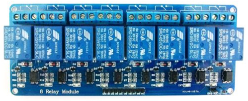

# Introduction
This is a marketing photo of the Raspberry PI 4 single board computer (hereafter referred to as "PI 4").


 
The PI 4 was selected as the hardware platform to support the solution's data-driven, automated Irrigation Control subsystem.  Deployed indoors, the PI 4 is powered by a combination uninterrupted power supply / surge protector unit.  It receives a reliable and strong WiFi signal from the vineyard and winery's wireless network.  In keeping with overall design principles, the PI 4 runs a "plain-vanilla" Raspbian OS install (i.e., Debian-based Linux variant) and the software installed on it was kept to a minimum. The PI 4's GPIO pins are employed for two functions: to control an 8-Channel Relay Module and to receive real-time input from a flow meter installed on the main water inlet from an irrigation well that serves the vineyard.

The photo below is a marketing photo of the 8-Channel Relay selected for use in this solution.  The high voltage AC side opens / closes individual valves plumbed into the 7 separate irrigation pipes routed to the vineyard's blocks (i.e., A – G).  The low voltage DC side is connected to the GPIO pins of the PI 4.



The photo below is a marketing photo of the flow meter used in this solution.  It is plumbed in-line from the irrigation well main water inlet before the fanout to the 7 irrigation blocks.  It is wired to GPIO pins on the PI 4.


Python 3+ was selected as the programming / scripting language that supports intelligent, automated  irrigation.  Every attempt was made to write efficient, self-contained scripts.  Modules were imported when warranted but they were all sourced from either the Python 3+ Standard Library or from the set of modules that commonly accompany a standard Python 3+ install.

# Design Considerations and Principles
* The PI 4 sensor station, responsible for Irrigation Control
  * Enjoys an external, unlimited power supply however, prolonged power outages must be taken into account
  * Enjoys Internet access however, unpredictable availability and bandwidth must be taken into account 
* Minimize the amount of processing logic (i.e., irrigation control software), and associated data, resident on the PI 4.  There are many good reasons for this decision.  A couple:
  * The AWS backend is far more reliable, has far more compute / storage capacity, and is far easier to access and to modify
  * Smaller and less complex software systems are generally more reliable and easier to troubleshoot / maintain 
* The PI 4 must engage in reliable two-way communication
  * With the AWS Backend
    * Raise alarm when alarm conditions are detected
    * Regularly request / obtain an up-to-date irrigation schedule
    * In support of a specific irrigation event
       * Signal beginning of irrigation event
       * Report total gallons dispensed at the end of an irrigation event
  * Obtain a date / time synch from a trusted Internet endpoint
  * With an Internet-based service provider, enabling reverse proxy services to support remote logon to the PI 4
* The Irrigation Control software loaded on the PI 4 must be highly reliable
* Data loss must be minimized (both temporarily stored sensor data and data destined for AWS backend)
  * A cost benefit analysis drove final architecture
  * A relatively small amount of data loss is acceptable.  This is not a mission critical (e.g., medical, financial) application; there will be no loss of life or financial penalty for a small amount of loss data  
* Remote access to the PI 4 from remote (beyond vineyard) locations
* Pulses from the flow meter are perishable; either catch them in real-time or loose the data

# Architecture
Unlike the Vinduino R3 Sensor Station and the Smart Home Sensor Station, the PI 4 is a general-purpose computer capable of serving as the sole platform for the solution's entire Irrigation Control subsystem.  That is, in and of itself, it is capable of storing all of the required data and executing all of the necessary algorithms to perform the Irrigation Control function.  This introduces architectural possibilities that are simply not present with the "at the vine" sensor platform and the "general weather" sensor platform.   

Unaided,  the PI 4 is not a suitable platform for solution's Irrigation Control subsystem for several reasons.  It represents a single point of failure and is limited with respect to long-term data storage and overall availability.  There is absolutely no comparison between the capabilities / capacity of a single, standalone PI 4 and the collective capabilities / capacity available with AWS services (i.e., availability, durability, storage capacity, compute capacity, long-term storage capabilities, support of vineyard operator access to data, and much more).  

A simple design of connecting relatively "dumb" sensors to an AWS backend, having the AWS backend store all data and conduct all algorithmic processing, is unsuitable due to the potential for interconnectivity issues between the sensors and AWS.  The data communications link between the vineyard and the outside world (i.e., Internet -> AWS) experiences unexpected outages of variable duration.  When the communications link is available, the effective available bandwidth can vary and do so into an unacceptable range.  A design directive requires continuation of normal vineyard operations, for a limited time, during Internet outages and periods of unacceptable bandwidth, making this design unsuitable.

The architecture of the solution's Irrigation Control subsystem blends the PI4 and AWS platforms.  A balance across both platforms was achieved such that the PI 4 executes algorithms autonomously yet remains informed and controlled by an AWS backend with the backend providing all long-term data storage.  Processing on the PI 4 platform commences with data supplied by the AWS backend, the processing is controllable by the AWS backend, and long-term storage for the data generated by processing on the PI 4 is provided by AWS services.  The autonomous nature of processing on the PI 4 platform addresses any interconnectivity issues (general availability and bandwidth limitations) between the PI 4 platform and AWS.  An effective way to characterize this architectural blending of platforms is "maximizing of data storage and processing on the AWS platform while minimizing it on the PI 4 platform."  More detail on this blending can be found below in the "Architecture Design" section below.

In keeping with design principles, the architecture of the solution's Irrigation Control subsystem
* Include a minimum amount of components
* Technologies and components
    * Suited to task; purpose-built; not mutated; neither under-powered nor over-powered (with the exception of the PI 4 hardware)
    * Used "out of the box" with minimal modifications and extensions
    * Open source / commercial technologies; custom development employed as last option

## Architecture Design
Some of the architectural elements of the solution's Irrigation Control subsystem warrant high-level description.

Logical, high-level Raspberry PI 4 platform sensor data ingestion path.


### Maximize AWS, Minimize Raspberry PI 4
The solution's Irrigation Control subsystem operates across the PI 4 platform and the AWS platform.  Connectivity between the two platforms can be interrupted for unpredictable periods of time.  Autonomous (i.e., no communication with AWS required) Irrigation Control processing on the PI 4 is possible because it receives data and control parameters, from the AWS backend, prior to initiating execution and it eventually transmits sensor data to the AWS backend.  While engaged in Irrigation Control processing, the PI 4 can be interrupted and redirected by input received from the AWS backend after initially commencing processing.  

The amount of data and processing resident on the PI 4 is minimized to what is required for autonomous processing.  Sensor data residency on the PI 4 is temporary and the scripts that enable processing on the PI 4 are configurable through control parameters retrieved from the AWS platform on a regular, scheduled basis.

System logging functionality is in place for the solution's Irrigation Control subsystem.  This system logging, as well as the system logging for the solution's Fermentation Monitoring, is the only case of data and processing that exists independent of the AWS platform. More detail on Irrigation Control system logging can be found below.

The architectural blending of the PI 4 and AWS platforms can be illustrated with the diagram below.  In this scenario the execution of an irrigation schedule, generated by the solution's "Intelligent Scheduling" mode, is interrupted by a vineyard operator.  The operator accesses a single page web application and takes zone A "offline," rendering it ineligible for irrigation.  The next "driest" zone (as determined by current soil moisture sensor readings) in this scenario happens to be zone B.  Zone B is scheduled, by the AWS platform, for irrigation and will receive irrigation for the remainder of the time allocated to the irrigation event which commenced with the irrigation of zone A. 


### Durable Data
Unlike the data structures of a process executing on an operating system, the operating system's flat files generally survive, intact, unexpected operating system shutdowns.

During Irrigation Control processing on the PI 4, all important data (that cannot be easily recreated) is checkpointed to flat files.  Rather than a process simply creating a data structure and working with it, the processes takes the additional step of saving the state of the data structure to purpose-built flat file.  File writes are immediately followed a call to flush I/O buffers.  Considering the processing power of the PI 4 relative to the amount of I/O overhead introduced by this design, no performance issues are introduced.  That is, the frequency of I/O calls, the average data size of the I/O calls, and the overall complexity of the Irrigation Control scripts have a no noticeable impact on the PI 4's resources.

All data destined for the AWS backend is stored in a flat file (e.g., sensor data, alarm state detected message).  A script executing on the PI 4 detects these data files, transmits them to AWS, and finally deletes them after receiving an acknowledgement from AWS of successful transmission.  Irregularities that might result from processing the same data multiple times is mitigated by designing all AWS platform ingress points as idempotent.
 
### Data Integrity
All local files used by Irrigation Control processes running on the PI4 include a hash value to help with data integrity validation.  Specifically, files contain both a data set and a hash value of the complete data set.  When working with a file, a process can quickly run the data set through the hash function and determine, to a reasonably high level of certainty, that the data set on hand is both complete and uncorrupted.  Corrupt files are not used.  Instead, they are transferred to a special purpose S3 bucket for manual analysis and potential data salvage.  To date, no corrupted files have been detected by the solution.  This data integrity validation scheme can be conducted on both the PI 4 platform as well as the AWS platform.

### Inter-Process Coordination
Irrigation Control processing on the PI 4 platform is carried out by two Python 3+ scripts.  The oversight script is invoked on a regular basis by the Linux cron utility.  This is far more reliable than invoking the oversight script at operating system boot time and having it run indefinitely.  As necessary, the oversight script initiates an irrigation script to oversee the irrigation of a specific a vineyard block.  The introduction of a separate process enables the oversight process to do other things while the irrigation process focuses solely on a single irrigation event.  The irrigation script remains active during the entire irrigation event tracking all flow meter pulses and performing near-real-time flow calculations in order to detect underflow and overflow alarm states.  At the conclusion of the irrigation event, the irrigation script reports, to the AWS backend, the total amount of water dispensed to the block.

During an irrigation event it is possible for the oversight process to prematurely stop the irrigation event.  To do so the oversight process will first place a special file in a directory that is regularly checked by the irrigation process.  If the irrigation process fails to honor the shutdown request, in a suitable amount of time, the oversight process will issue the necessary kill command (initially try a graceful shutdown) to stop the irrigation process.  

## Infrastructure / Network
A logical infrastructure / network diagram for the Irrigation Control subsystem of the solution.


From a technology perspective, the largest operational challenge faced by the vineyard operators is maintaining reliable data communications.  The benefits of proactively rebooting all communications equipment on a scheduled basis has been presented to the client and all vineyard operators.  At present, this proactive rebooting process is conducted manually, by my client has committed to investing in an intelligent UPS (uninterrupted power supply) unit that can be programmed to cycle power to various pieces of equipment based on a defined schedule and can be remotely (i.e., over the Internet) directed to cycle power.

The PI 4 platform sits behind a NAT (network address translation) table within the vineyard and winery's ISP's (Internet Service Provider) modem.  This makes establishing a remote logon session to the PI 4 difficult.  Following design principles, an open source / commercial solution was put in place to enable remote log in session instead of creating a custom solution.

# Web Applications
The solution includes a collection of single-page web applications, hosted in S3, to support Irrigation Control.  The applications leverage multiple JavaScript SDKs (software development kits) to facilitate interoperation with the AWS backend.  Security features route through an AWS Cognito SDK, data requests and alarm detection signals route through an AWS API Gateway SDK, and data insertion / modification features route through an AWS DynamoDB SDK.  

For Irrigation Control, a vineyard operator can work through different single page web applications to:  
* Configure overall irrigation settings
  * Select irrigation mode ("intelligent", "set", or "none")
  * View the current irrigation schedule
  * Determine which irrigation schedule is currently in place on the PI 4 platform
  * For a given vineyard block
     * Take the block in / out of consideration for all alarms
     * Take an irrigation in / out of consideration for irrigation when in Intelligent Scheduling mode
     * Define soil moisture thresholds
     * Define minimum required gallons dispensed to consider a location to have been irrigated
* Configure irrigation alarms
  * Individually, turn an alarm on / off
  * Set vineyard-wide thresholds for alarms
  * Set block-specific thresholds for alarms
* Configure irrigation schedules
  * Configure the Intelligent Scheduling algorithm
  * Define irrigation schedule for Set Scheduling mode

Vineyard operators gain access to the single-page web applications using a standard web browser and their AWS Cognito user pool user id and password.  Data input (i.e., new data and modification of existing data) is achieved through the combination of custom JavaScript and multiple JavaScript SDKs.  More detailed information (i.e., architecture, source code) on the single page web applications can be found in the README.md file in the **backend** [subfolder](https://github.com/JayeHicks/ManageIrrigation/tree/master/backend).

Screen capture snippet of a single-page web application that allows a vineyard operator to configure data driven algorithm that automatically controls vineyard irrigation.


# Software
The  complete set of Python 3+ scripts that support the solution's Irrigation Control subsystem will be loaded in the source-code [subdirectory](https://github.com/JayeHicks/ManageIrrigation/tree/master/irrigation/source-code) after final user acceptance testing concludes.  At the time of this writing final use acceptance testing is underway.

High-level application architecture of the solution's Irrigation Control subsystem.


For Irrigation Control, the PI 4 platform carries out two basic functions: turn irrigation valves on / off, report how much water was dispensed to a vineyard block. To achieve these functions, two Python 3+ scripts are deployed on to the PI4: an Oversight script and an Irrigation script.  The Oversight script is invoked on a regular basis by the PI 4's operating systems cron utility.  The Oversight script invokes the Irrigation script, as necessary, to oversee the irrigation of a specific vineyard block.  The Oversight script can stop the Irrigation script, if necessary, and is also responsible for communicating with the AWS backend.  The Irrigation script is responsible for not only opening irrigation valves but also tracking the amount of water flowing to a vineyard block.  By tracking water flow the irrigation script can detect under / over flow alarm states and calculate the total amount of water dispensed to a vineyard block.

Central to both scripts is the concept of an irrigation schedule.  The Oversight script polls the AWS backend continuously for any irrigation schedule updates.  Irrigation schedules inform the Oversight script of when to initiate irrigation to a vineyard block and also provide the details that will be required by the Irrigation script so that it can oversee the irrigation event (duration, flow rate tolerances).

The pseudo JSON snippet below is a conceptual depiction of an irrigation schedule generated by the AWS platform and executed by irrigation script running on the PI 4 platform.  The expected flow (i.e., exp_fl) value is expressed in gallons per minute.  The overflow deviation threshold value (i.e., ov_fl) represents a percentage.  The underflow deviation threshold value (i.e., un_fl) represents a percentage.
```
{created: 1595311260,
 id: 721,
 day1:
 {date: 2020-07-21,
  {events:
  {event: 1,
   zone: a,
   start: 08:00,
   duration: 4:00,
   exp_flow: 5,
   ov_fl: 10,
   un_fl: 15},
   {event: 2,
    zone: b,
	start: 20:00,
	duration: 4:00,
	exp_fl: 8,
	ov_fl: 12,
	un_fl: 7}}},
  day2: <would follow same pattern as day1>
 }
```
For any irrigation event two data messages are sent by the PI 4 platform to the AWS backend.  The first message is sent at the time that the irrigation event starts, reporting that a single gallon has been dispensed to the block.  This message updates a status table and ensures that the block will not be scheduled for irrigation during another of the day's irrigation event time slots.  The second message is sent after the irrigation event has concluded and it updates the data record written by the first message with the actual number of total gallons that were dispensed.

The amount of water dispensed to a block during an irrigation event is tracked, in 60 second increments, to a PI 4 platform local file.  That is, a data record is added, every minute, to a local file that is dedicated to a single irrigation event.  The psuedo JSON data records below provide a conceptual depiction of this progress tracking.  In the example record set below you can see that an unexpected PI 4 reboot occurred during the irrigation event; sometime after the second record set.  Despite this interruption the total gallons dispensed can be calculated with minimal loss of data.  In practice, the local file name encodes the date, irrigated zone, irrigation schedule id, and irrigation event number.

```
{date: 2020-07-21,
 zone: a,
 records:
 {{script_start: 8:01,
  sched_id: 721,
  event_id: 1,
  event_start: 8:00,
  event_dur: 4:00,
  time: 8:01,
  gal_disp: 1},
  
  {script_start: 8:01,
  sched_id: 721,
  event_id: 1,
  event_start: 8:00,
  event_dur: 4:00,
  time: 8:02,
  gal_disp: 8},
  
  {script_start: 8:01,
  sched_id: 721,
  event_id: 1,
  event_start: 8:00,
  event_dur: 4:00,
  time: 8:11
  gal_disp: 1}}
} 
```

## Alarms
Alarm processing for solution's Irrigation Control subsystem occurs on both the AWS platform and the PI 4 platform.  Configuration values (e.g., flow tolerances) used by alarm processing algorithms executing on the PI 4 platform are present in irrigation schedules. 

AWS backend alarm processing
* Elapsed time since last PI 4 request for up-to-date irrigation schedule
* Outdated soil moisture sensor data

PI 4 alarm processing
* Elapsed time since last successful data / time synchronization
* Elapsed time since last irrigation schedule update
* Flow rate; underflow / overflow detected

Real-time awareness of Irrigation Control alarms is a high priority for vineyard operators.  Under / over irrigation at certain critical times during the year can have a devasting impact the quantity and the quality of a vineyard's grape production.  Vineyard operators can use a single page web application to customize the expected flow rate for each vineyard block in order to proactively detect irrigation issues in near-real-time.

## System Logging
See the System Logging section of the README.md file located in the **backend** [subdirectory](https://github.com/JayeHicks/ManageIrrigation/tree/master/backend) of this repository for a holistic treatment of the entire solution's system logging functionality.


For processing that occurs on the PI 4 platform, system logging data and processing is kept on the PI 4 platform.  If it were not for the potential for data communication issues between the PI 4 platform and the AWS platform (i.e., unavailability or unacceptable bandwidth), processing occurring on the PI 4 platform would submit system logging messages to the AWS backend for storage.  The data generated by processing occurring on the PI 4 platform represents the only data across the entire solution that is not stored in AWS.  Even though the PI 4 system logging system is independent of the AWS backend, it will forward a copy of any error message or serious issue message to the AWS backend for long term storage.

The PI 4 localized system logging system is virtually identical to the AWS-based system logging system that supports the "at the vine" sensor station processing.  The only difference between the two systems is that the PI 4 version stores system log messages in flat files while the AWS version stores messages in DynamoDB tables.  The flat files used for system logging are curated by automated processes that regularly trim off the oldest records contained in system log files.  By managing the file size, unacceptable file I/O performance, stemming from excessively large file sizes, is avoided.

The PI 4 localized system logging solution does not introduce a data fragmentation issue for the overall solution.  The system logging messages only pertain to the operational details of processing that occurs on the PI 4 platform.  Any errors or serious issues encountered by processing on the PI 4 platform will be reported to the AWS backend (i.e., invoking an AWS API Gateway endpoint).  

## Algorithms
### Oversight Script
* Call Internet endpoint for date / time synch
* Clean up anything residual from prior executions
  * Inter-process coordination
  * Data transmissions to AWS backend
* Provided there are no residual data messages for "number of gallons dispensed" then obtain an updated irrigation schedule
* If the most up-to-date irrigation schedule is not too old, execute the schedule
  * Shutdown any irrigation event underway that should not be underway
  * Start an irrigation event that should be underway but is not
  * Exit
* Else (i.e., the most up-to-date irrigation schedule is too old)
  * Close all irrigation valves
  * Send alarm
  * Clean up anything residual from prior executions
  * Exit

### Irrigation Script
* If irrigation event details are verified
  * Initialize irrigation event
    * Close all valves
    * Send "1 gallon dispensed" message to AWS backend
    * Set gallons_dispensed variable to 0
    * Create local files
       * File to track gallons dispensed
       * File to designate which block is currently being irrigated
  * Open correct valve
  * Repeat loop until irrigation event is over
    * Update local data file with gallons_dispensed variable
    * If inter-process coordination signal from Oversight script go to "Close out" below
    * Test for under / over flow alarm condition, raising alarm if detected
  * Close out
    * Close all valves
    * Exit
* Else (i.e., one or more irrigation events details are problematic)
  * Close all irrigation valves
  * Send alarm
  * Exit

# Tips and Techniques
* Ensure that the channel relay you select completely isolates low voltage DC, coming from the PI 4, from high voltage used to actuate the irrigation valves.  This separation is often referred to as ‘optocoupler isolation.  Without the separation, high voltage current can damage the PI 4 board.
* Python
   * System logging
      * There is a wide variety of Python modules readably available that one can use for system logging, however, I elected to craft my own minimalistic, streamlined logging solution that would contain no extraneous functionality
     * My custom logging solution requires, per source code file, two global variables and two short functions.
     * Logs are collected in two files: one for informational / warning messages and one for issues / alarms.
     * The Oversight script curates the size of these files to maintain optimal file IO performance.
   * The solution uses a simple, light-weight, efficient data integrity mechanism to validate local data files as well as data transmissions between the PI 4 platform and the AWS platform.
      * If you choose to use a similar mechanism, use the hashlib.py module to generate hash values on data sets.  Do NOT use Python's built-in hash() function as different installations of Python will generate a different hash value despite being passed the exact same string.  Interestingly enough, this is by design and does not represent an error.
      * By storing the hash value of a data set alongside the data set, the hash function can be run again in the future to verify its data integrity on either the PI 4 platform or the AWS platform
  * A regularly executed script (i.e., Linux cron job) is less complicated and more reliable / robust than a long running script
* Linux
  * I found it easier to develop on my laptop using Windows Subsystem for Linux (WSL) versus on the PI 4.  I did not do so by installing Linux on my machine to enable dual booting it into Linux or Windows.  The WSL is not a full-blown OS install.  Instead, it is a lightweight compatibility layer that enables you to run Linux binary executables (in ELF format) natively on Windows 10.
