# Introduction
Normal vineyard operations include the ongoing collection and processing of sensor data from sensor platforms located outdoors.  This requires the sensor platforms to withstand the elements, provide their own electrical power, and report sensor data via the vineyard and winery's consumer-grade WiFi network, which is integrated with an Internet Service Provider's modem.  Sensor data is ingested into the AWS backend for access by the vineyard operators as well as for long term data storage.  AWS resident processing is employed to both curate the data and to continually scan sensor data values for alarm state conditions.  If an alarm state condition is detected vineyard operators will be alerted via SMS messaging and email messages.

# General Weather Conditions
A marketing photo of WeatherFlow's commercially available Smart Home Sensor Station.

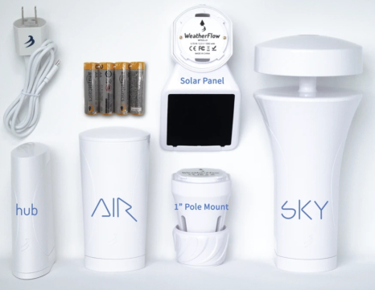

For the daily collection of local, general weather conditions, the Smart Home Sensor Station was selected and integrated into the solution.  From this solution's perspective, this sensor platform can be considered "closed" as it reports sensor data to a specific backend.  The platform cannot be configured to send sensor data directly to AWS IoT.  As such, an AWS Lambda function is invoked on a scheduled basis, via an AWS CloudWatch Event Rule, to obtain sensor data from an Internet endpoint and pass the data along to AWS IoT (see diagram below).  The Python source code for this Lambda function is contained in the weather_station.py file located in the **backend** folder in the [source-code/at-the-vine/data-ingest-curate](https://github.com/JayeHicks/ManageIrrigation/tree/master/source-code/at-the-vine/data-ingest-curate) subdirectory. 

Logical, high-level Smart Home Sensor Station sensor data ingestion path.

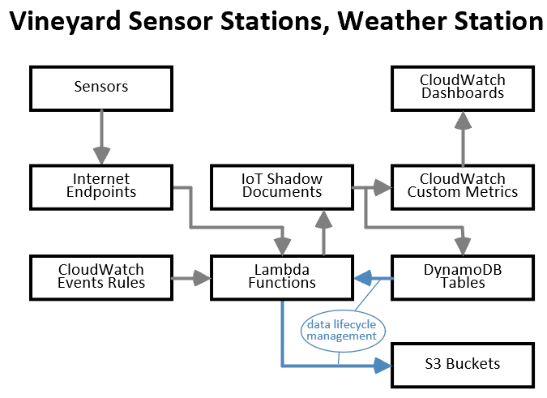

General weather conditions data is collected and stored, long term, for the purpose of future reference of historical weather conditions data.  This data is not collected to support alarm state detection nor presentation to vineyard operators via a single page web application.  The data is ingested daily and housed in a DynamoDB table.  At the beginning of each month the previous month's data is bundled together and archived into a CSV (comma separated value) formatted file that is placed into a special purpose S3 bucket.  Vineyard operators interact with this day by accessing archive files contained in the special purpose archival bucket. 

The architecture, design, and technologies supporting ingestion, management, and access of general weather conditions data is a proper subset of the architecture, design, and technologies supporting "at the vine" sensor data.  Refer to the "conditions at the vine" section below for this detail.

# At the Vine Conditions
For the hourly collection of sensor data "at the vine," the commercially available Vinduino R3 Sensor Station, was selected and integrated into the solution.  In addition to writing the firmware for this sensor station, each of the 21 boards required sensor integration and mounting into a suitable weather-proof box (see picture below).  This involved soldering, cable fabrication, modification to each box, and source materials from my local hardware store.   

"Vinduino" is a play on words (i.e., Vineyard + Arduino).  The Arduino IDE (integrated develop environment) is a popular, no-cost software application used to flash firmware to a wide selection of commercially available, micro controllers.  Generally speaking, microcontrollers have limited resources and run a special-purpose program.  In contrast, microcomputers generally have ample resources, run a general-purpose operating system, and are capable of running a wide variety of programs.  To use the Arduino IDE, you write procedural code in a C / C++ like language, select your target micro controller, physically connect a programming cable from the computer running the Arduino IDE to the micro controller, and then finally select an arrow icon in the Arduino IDE's title bar to flash the firmware you wrote onto the connected micro controller.

Of direct interest to this solution, the Vinduino R3 possesses:
* ATMega 328P micro controller
* PCF8563 Real Time Clock
* Complete power management solution
* Screw-top lead wire connectors (accept bare wire)
  * Solar panel leads
  * Soil moisture sensors leads (up to 4 sensors)

I labeled the marketing photo below of a Vinduino R3 Sensor Station straight out of the box.  To maximize the lifespan of each board, I soldered female IC sockets onto the boards so that they can accept the ESP8266-01 WiFi chip and the leads from the DS18B20 temperature sensor.  Note the prongs extending from the elevated mini board in the lower left-hand corner.  These prongs are used with a programming cable to flash firmware to the ATMega 328P.

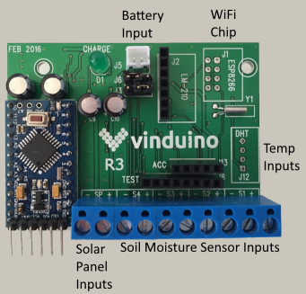

I took the picture below to document the full inventory of individual components required to assemble an "at the vine" sensor station: a mini solar panel, a 3.3V lithium ion battery, a Vinduino R3 Sensor Station, a DS18B20 waterproof temperature sensor, an ESP8266-01 WiFi chip, a set of three Watermark soil moisture sensors, and a hermetically-sealed, UV-resistant box. Note that the ESP8266-01 WiFi chip is not pictured below.  My client buried the three soil moisture sensors located at each specific vineyard location at the progressive depths of 12", 24", and 48".  

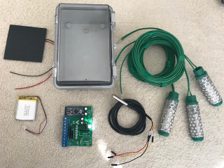

I took the picture below to document an assembled "at the vine" sensor station that is being flashed with firmware prior to deployment.  The ESP8266-01 chip, missing in the photograph above, is located in the upper right-hand corner of this picture.  At a vineyard location, cabling from the three soil moisture sensors and the temperature sensor will be routed up through a hole drilled into the bottom of the box.  In addition, the miniature solar panel will be attached inside the box; the box will be pole-mounted at the optimal angle to receive maximum sunlight.    

To help manage condensation within the box multiple silica gel packs are sandwiched between the white PVC board (i.e., the surface with writing on it) and the back of the box.  The hole in the bottom of the box, used to route cables through, is caulked with silicon adhesive.  And finally, before physical deployment into the vineyard, a vineyard operator blasts nitrogen into the box.

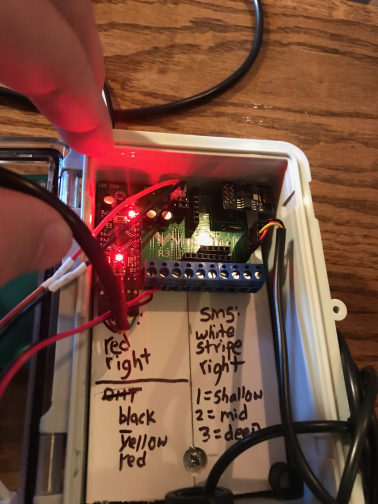

A vineyard operator took the picture below of an operational sensor station deployed in the vineyard.  If you look to the bottom left of the photo you will see three white pvc pipes emerging from the ground.  Each of these pipes contains a soil moisture sensor located at a different depth.

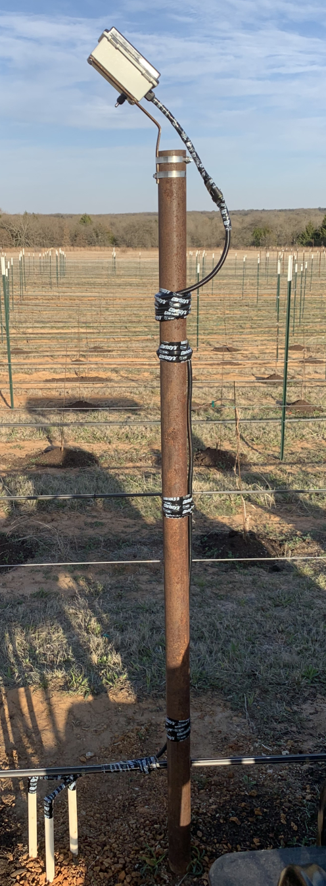

## Design Considerations and Principles
* Battery power conservation is paramount
   * Sensor stations spend the majority of the time in a sleep state, waking once an hour to collect and attempt to transmit sensor data
    * Soil moisture sensor readings, require a fair amount of electrical power, are taken once a day
    * Minimize the amount of processing logic and data stored on the platform
* Sensor data transmission is by design a one-time, one-way communication event
  * There is no provision to detect the success / failure of data transmission
  * Sensor data is not stored on the sensor platform; this would be necessary for data transmission retries across sleep / wake cycles
  * Individual stations attempt 24 transmissions a day; a single successful data transmission per day is acceptable
* For data communications, the Vinduino R3 Sensor Station can be configured to use the ESP866-01 WiFi chip or a LoRa module. R3 boards in this solution are configured with the ESP8266-01.
  * Following design principles, the ESP8266-01 is used "as is."  No physical modifications (e.g., soldering wires to connect chip pins together) were made to the chip and its factory firmware is used.
  * Communication, using ESP8266-01 chips running factory firmware, is achieved using primitive "AT" commands 
     * AT commands are essentially primitive TCP / IP commands
     * Using AT commands to directly submit sensor data to AWS IoT is impractical, if not impossible
     * An Internet-based service provider has been incorporated into the solution to serve as an intermediary that is polled by a scheduled AWS Lambda function to feed sensor data to AWS IoT
     * Should a future need arise, it is most likely possible to configure an API Gateway endpoint to serve as the "http" target for the Vinduino R3 Sensor Station platform.  I'd have to investigate this further as API Gateway only supports the creation of "https" endpoints.
  * Communication events are one-time, one-way.
  * The AWS backend ingress point for this sensor station is AWS IoT Core.  This requires an intermediary between the Vinduino R3 and AWS

## Communication Channels
Data communications for the "at the vine" sensor station platform flows in one direction: from the sensor station towards the AWS backend.  Each data transmission event is a one-time, one-way single attempt.  Data transmitted from the "at the vine" sensor station that is not received by the third-party service provider (e.g., www.thingspeak.com) is irretrievably lost.  This is acceptable as individual stations attempt 24 transmissions a day and a single successful data transmission per day is deemed adequate.

The diagram below provides additional detail beyond the more abstract diagram labeled "Vineyard Sensor Stations, Weather Station" contained in the "General Weather Conditions" section above. 

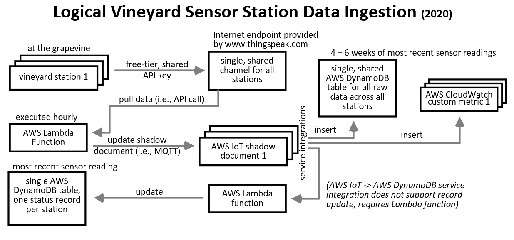

The diagram below provides a detailed trace of a single Vinduino R3 Sensor Station data record across all of the solution's components through to the vineyard operator's download of sensor data contained in an archive file.
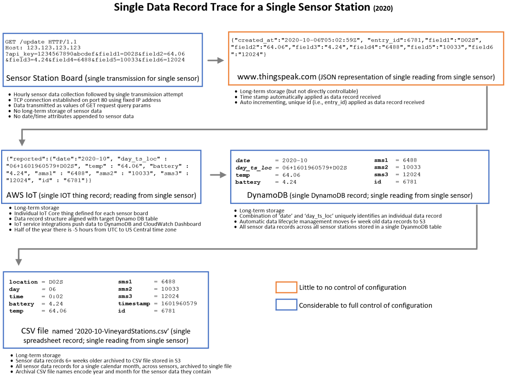

## Web Applications
The solution includes a collection of single-page web applications, hosted in S3, to support vineyard operator interaction with "at the vine" sensor data.  The applications leverage multiple JavaScript SDKs (software development kits) to facilitate interoperation with the AWS backend.  Security features route through an AWS Cognito SDK, ad hoc invocation of alarm state detection algorithms route through an AWS API Gateway SDK, and data insertion / modification features route through an AWS DynamoDB SDK.  

Single page web applications, working with "at the vine" sensor data, provide the following functionality:
* Configure sensor data monitoring alarms
  * Turn monitoring alarms on / off
  * Add / remove a specific "at the vine" station from consideration by alarm processing
  * Adjust threshold values and data shelf-life values
* Ad hoc data entry
  * Planting dates for individual vines
  * Observations specific to vineyard location
  * Actions taken (e.g., dispense pesticide) taken at a specific location
* View current sensor data records; view sensor data records for a specific date
* View current system logs; view system logs for a specific date

Vineyard operators gain access to the single-page web applications using a standard web browser and their AWS Cognito user pool user id and password.  Data input (i.e., new data and modification of existing data) is achieved through the combination of custom JavaScript and multiple JavaScript SDKs.  More detailed information (i.e., architecture, source code) on the single page web applications can be found in the README.md file of the **backend** [subdirectory](https://github.com/JayeHicks/ManageIrrigation/tree/master/backend).

Screen capture snippet of a single-page web application that allows a vineyard operator to configure sensor data monitoring alarms.

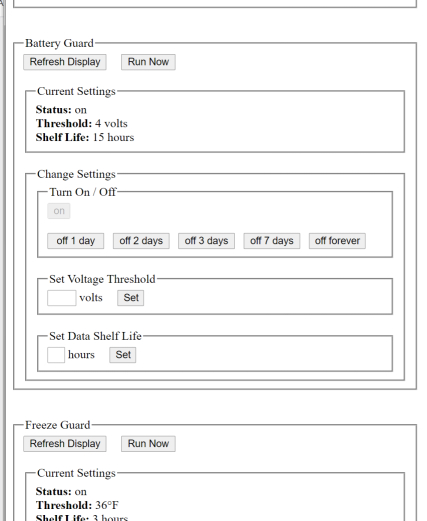

## Software
General information and guidance for the Arduino IDE can be easily sourced at www.arduino.cc or through basic Internet searches.

To flash firmware to a micro controller using the Arduino IDE, you write algorithms in a C / C++ like language, select the target micro controller, physically connect a programming cable from the computer running the Arduino IDE to the micro controller, and finally select an arrow icon in the Arduino IDE's title bar to flash the firmware you wrote onto the micro controller.  After you have successfully flashed firmware to a microcontroller, or power up a microcontroller that you have previously flashed, the firmware automatically begins executing.  Specifically, the function named setup() executes a single time and then the function named loop() is invoked infinitely. 

The software for the solution's "at the vine" sensor station (i.e., Vinduino R3 Sensor Station) is firmware that you flash to a microcontroller.  It can be found the source-code/at-the-vine [subdirectory](https://github.com/JayeHicks/ManageIrrigation/tree/master/vineyard/source-code/at-the-vine).

Helpful hints for reviewing the software for this portion of the solution.
* Start your review with the file named CustomFirmware.ino as it contains the setup() and loop() functions
  * When writing the code contained in CustomFirmware.ino, I stared with source code from the Vinduino GitHub repository located at https://github.com/ReiniervdL/Vinduino.  However, CustomFirmware.ino should be viewed as a complete rewrite as the original code was debugged, completely refactored, and significantly augmented.
  * My firmware enables a reasonably tech-savvy vineyard operator to easily flash firmware to an "at the vine" sensor station (test or production) and to easily adjust the station's sleep duration.
  * The firmware's basic algorithm
       * Wake up after an hour of sleep
       * Collect battery level reading and temperature reading
       * If 24 hours have elapsed, since last soil moisture sensor readings, collect those readings
       * Make single attempt to transmit all sensor readings (including soil moisture[repeat or newly collected])
       * Go to sleep
* Dependencies
    * The wire.h and math.h files are implicitly / universally provided by the Arduino IDE
    * All other dependencies, required to compile the firmware, are collocated in the single directory
    * To collocate all dependencies I had to modify the file OneWire.h file 

## Tips and Techniques
### Arduino IDE Programming
* Make 100% certain that you have the correct cable to connect the computer running the Arduino IDE to the microcontroller.  I wasted a few hours of my life struggling with a 5V cable as the Vinduino R3 Sensor Station's microcontroller requires a 3.3V cable.  Annoyingly, the versions of the cable are identical in appearance.  Ensure that you plug the cable into the prongs on the R3 board in the correct orientation.  Incorrect orientation will certainly damage the board.
* Keep in mind that you are writing firmware for an environment in which race conditions must be accounted for.  It is quite possible to write firmware that sends a signal to a chip, immediately reads from the same chip, and determines that the value read is not what was expected.  This can occur because the read was executed before the signal sent to the chip had sufficient time to propagate through the chip's circuitry.  To account for race conditions, you will need to introduce processing delays using the "delay()" command into your firmware.
* The Arduino IDE was designed to make life simple for the hobbyist.  It hides many implementation details including the libraries incorporated into the firmware that is being flashed to a microcontroller.  I recommend that you work around this particular IDE convenience and manually collect / manage all of your firmware's libraries in a single folder.  In this way your firmware's dependencies are directly visible and are under your direct  control.
* If you decide to incorporate a third-party library into your firmware, choose wisely if you are presented with a selection.  Keep in mind that the Arduino ecosystem is like any open source community; anyone can contribute anything.  When selecting a library look for one
  * Provided by a solvent organization vs. an individual
  * With evidence of a history of ongoing updates, responses to user request / feedback, activity, etc.
  * With source code resembling professional software
* The Arduino IDE is relatively stable, but I have found it to be twitchy on occasion
  * If things that used to work suddenly stop working, obviously take a quick look at the most recent changes that you have made but don't fixate on them for too long.  It can prove, more times that it probably should, that your problems will clear up after closing the Arduino IDE application and bringing up a new one.
  * The Serial Monitor (mechanism that allows you to see output from your executing firmware) can be twitchy.  
     * When strange messages start appearing, it's always a good idea to shut down the existing monitor and bring up a new one.   You might also close the Arduino IDE and bring up a new one.  And finally, you might try different things and / or try the same thing in slightly different ways. Taking all of these steps before you accept what the Serial Monitor is telling you might prove to save you a significant amount of time and effort (i.e., discovering that rolling back a recent change does not clear up the strange messages you are seeing in the monitor).
    * If you write a large amount of text to the Serial Monitor or you issue back-to-back writes to the Serial Monitor, you might see garbled text displayed in the Monitor.  To get around these issues you can reduce the amount of text that you send to the monitor and you can insert a "delay()" commands in your firmware source code between your back-to-back commands that send data to the Serial Monitor.
* To avoid damaging the R3 board you need to understand how to power it.  A clear understanding of how the R3 board powers different components when powered from different power sources (i.e., battery vs. programming cable) can serve you well, saving you time and aggravation.
    * Ensure that your ESP8266-01 WiFi chip is truly in sleep mode when you think it is.  There are two red LEDs and a single blue LED on this chip.  When the chip is in sleep mode you should see only a single red LED lit up.  It you see two LEDs lit up then the chip is not in sleep mode and the radio transceiver is drawing power.  As a side note, the blue LED flashes when the chip is transmitting or receiving radio signals.
   * Power is only supplied to the ESP8266-01 WiFi chip when the R3 board is operating under battery power.  The WiFi chip will not receive power when the R3 board is powered by the programming cable.
   * It is possible to bring up an Arduino IDE Serial Monitor while the R3 board is operating on battery power. This requires that you connect two pins from the micro controller side of the programming cable (the cable that you use to flash firmware to the R3) into the "J2" bank of IC sockets on the R3 board.  You can find detailed guidance for this procedure in a FAQ at www.vinduino.com.
   * You can run in battery power mode without draining power from the battery.  To achieve this plug in a battery and additionally plug leads from a 5V charger (i.e., common smart device charger) into the solar panel inputs on the R3 board's screw top sockets labeled "SP" (i.e., Solar Panel).  Note that if you crosswire the "+" and "-" while you are making these connections you will damage the R3 board.
   * Power the R3 board from the battery or the programming cable, never both.  Doing so will damage it.

### Sensor Station Prototyping
* Microcontrollers are relatively inexpensive; typically in the $5 USD range.  If you have little to no experience in physically assembling IoT sensor stations, you may benefit from selecting an easy-to-use microcontroller to begin with.  Personally, the NodeMCU worked well for me to conduct all of my prototyping.  It not only has an on-board, integrated WiFi chip but it is easy-to-use and was my initial guess as to the microcontroller that I would use for the "at the vine" sensor station platform.

Marketing photo of the NodeMCU microcontroller.

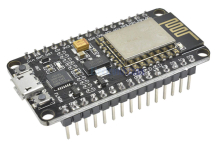

* When engaged in prototyping of any sort, eliminating as many extraneous variables as possible is useful.  Because this consulting engagement represented my first dive into AWS IoT, Arduino IDE programming, and designing IoT sensor stations, I selected a modern, popular, easy to use microcontroller (i.e., NodeMCU).  Because this microcontroller is popular, I found a large amount of sample firmware (including source code to control all of the sensors that I wound up using for the vineyard) within the Arduino IDE on-line community.  In addition, on the Internet at large, I found several high-quality, on-line tutorials. After gaining experience with the NodeMCU itself, I proceeded by incorporating different components into my sensor station platform prototypes, introducing one component at a time.  This "divide and conquer" strategy saved me time as I had fewer places to look when the sensor station platform behaved in unexpected ways.

The photograph below is one I took, to share with my client, of an early successful, feature-complete proof of concept for the "at the vine" sensor station.  Ultimately, the only component pictured below that was incorporated into the final sensor station platform deployed to the 21 locations in the vineyard was the DS18B20 waterproof temperature sensor.

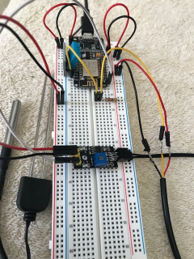

### Vinduino R3 Sensor Station Physical Configuration
* Undoubtably obvious to most readers, do not solder your communications chip or the leads from your temperature sensor (or any sensor) directly onto the Vinduino R3 Sensor Station board.  Instead solder common Integrated Chip female sockets onto the board into which you can insert chips and sensor leads.  This allows you to easily swap out failed WiFi chips or temperature sensors.
* You can prolong the life of your R3 boards by taking extra steps 
  * You will render an R3 board useless if you damage the delicate battery connector fixed to the board.  To help prolong the life of your R3 boards buy male and female IS connectors and create an IS "extension cord" (i.e., solder two wires together and finish with heat shrink tubing) that has a male end and a female end.  You plug the male end into the R3 board's female IS battery socket and the female end of the extension cord connects to the battery.  You should never have to fiddle around with (and potentially damage) the battery connector located on the board once you have a viable extension cord in place.
  * Create a weatherproof male / female connection, that will live outside of the sensor station box, for the soil moisture sensor wire leads.  This will enable you to screw soil moisture sensor leads into an R3 board a single time and then going forward you use the male / female connector (outside of the box) to deploy a sensor station box to the vineyard.  This not only saves time but enables you to leave the silicon caulking, used to seal up the hole in the box through which wiring is routed, in place. 
  * Take steps to reduce moisture content inside the box
     * Place a moisture control silica gel packets in each sensor station box.  
     * Do not use wood, or any other material that has the potential to hold moisture, for the mounting board that you use to secure to R3 board.  I used PVC house siding, sourced from my local home center, that was easy to cut to size (i.e., see white board with writing on it in photo above).
    * When deploying a board to the vineyard blast out as much oxygen as you can, replacing it with an inert gas such as nitrogen
    * Seal up any holes in the box using silicon caulk adhesive
    * Select a box that can be hermetically sealed (e.g., rubber gasket)
* Conserving battery power
   * Ensure that the pin jumpers (i.e., pin jumpers physically connect two adjacent pins in a bank of pins) at locations J6 and J3 on the R3 board are connecting the middle pin to the right-most pin. That is, the two pins closest to the ESP8266-01 WiFi chip, vs the pins closest to the ATMega 328P microcontroller, are jumpered together.  All 21 R3 boards that I received from the manufacturer had the J3 jumper in the correct position but the J6 jumper incorrect position.  If you do not have both jumpers in the correct positions the WiFi chip will continuously draw power, even if your firmware places the WiFi chip in sleep mode.  Most Lithium Ion batteries will fail within 24 hours of continuous power draw by the WiFi chip.
* When trouble shooting communication failures of a R3 board do not rule out issues with the WiFi network.  Every situation is different but some of the following advixe might prove useful in your situation
   * Make use of the variety of WiFi devices available to you (e.g., smart phone) to identify and ultimately verify the elimination of WiFi dead zones or weak spots.   Almost any portable WiFi device will prove far more flexible and efficient in this task than an R3 board.
    * The longer that consumer grade electronics (e.g., a WiFi router, the modem provided by your ISP) run the greater the potential for erratic, erroneous behavior.  Best practice warrants a proactive, scheduled reboot for all of your communications devices.  Take note of how long power should remain off in order to effect a hard reboot of your devices.  Also be aware that the order in which you power up devices can be important in some cases.  Sorting through and taking note of all this detail when all things are operating normally can help you quickly diagnose issues in the future.  Something as simple as documenting what lights are on, are off, are flashing, etc. when everything is normal can save you time and effort.
    * More times than not, strange things clear up with reboots (or multiple reboots) and resist definite root cause analysis.  Remember, the quality standard for consumer grade electronics is more often "good enough" vs. "good."
